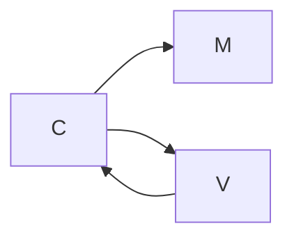

#  HTTP

+   plaintext
+   cliente-servidor
+   metodos: le dan una semántica a las rutas

### Headers

+   metadatos
+   pueden estar en el _request_ o en la _response_
+   formato clave-valor
    +   User-Agent
    +   Referrer
    +   Accept
    +   Host
    +   Authorization

```html
<!--viewName.hbs -->
<html>
    <body>
        <h1> {{nombre}}</h1>
        ...
    </body>
</html>

<!--viewName.hbs -->
<html>
    <body>
        <h1> {{nombre}}</h1>
        <form method=POST action="/consultoras">
            <div>
                <label>Nombre:</label>
                <input name="nombre" type="text">
                <input type="submit">
            </div>
        </form>
    </body>
</html>
```

```java
class Server {
    public static void main(){
        port(9000);
        DebugScreen.enableDebugScreen();
        HandlebarsTemplateEngineBuilder builder = ...;
        TemplateEngline engine = builder.withDefaultHelpers().withDefaultHelpers()...;
        get("/consultoras/new",Server::getFormularioNuevaConsultora, engine); //es con patternMatching, busca primero en new y despues en id
        get("/consultoras/:id", Server::getConsultora, engine);
        
        post("/consultoras", Server::createConsultora, engine);
        
    }
    static ModelAndView getConsultora(Request, Response) {
        return ModelAndView(
            todasLasConsultoras.get(valueOf(req.params("id")),
            show.hbs;
        )
    }
	static ModelAndView getFormularioNuevaConsultora(Request, Response) {
        return ModelAndView(null, new.hbs);
    }
            
    static ModelAndView createConsultora(Request, Response) {
        String nombre = request.queryParams("nombre") //NO es un query pram. flasheo el framework. el "name" del html.
         .. crear y agregar la consultora
        response.redirect("/consultoras/"+indexNuevaConsultora);
        halt();
        return null;
    }
}
```

# MVC Web



1 controlador por recurso, con cada metodo hTTP


```html

{{#consultoras}}

<tr>

<td>{{nombre}}</td>

<td>{{cantidadDeEmpleados}}</td>

</tr>
```

