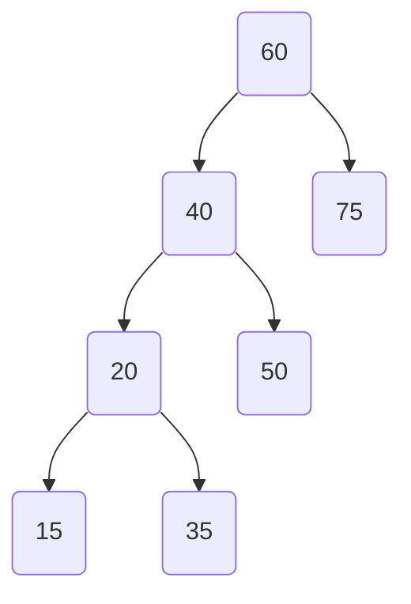
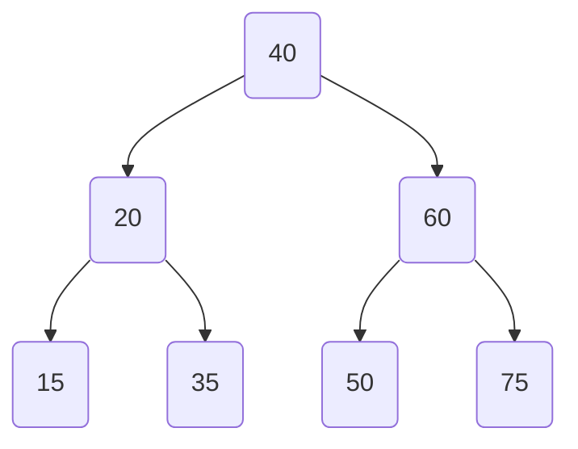
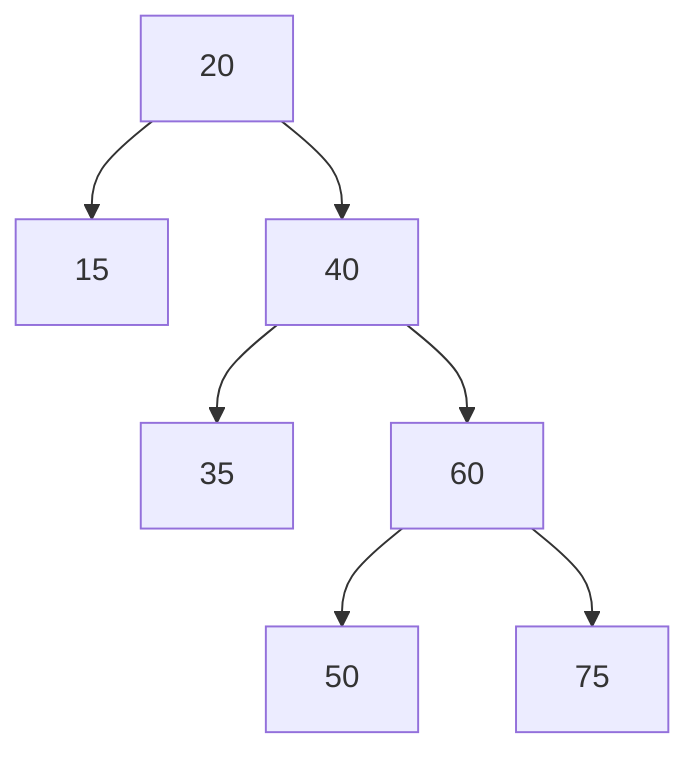
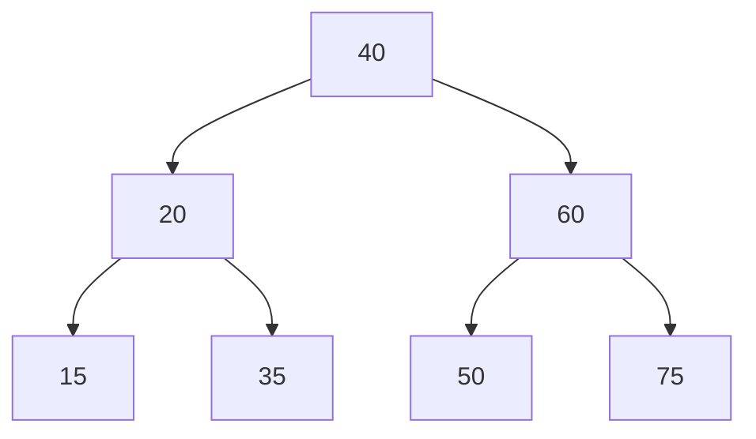
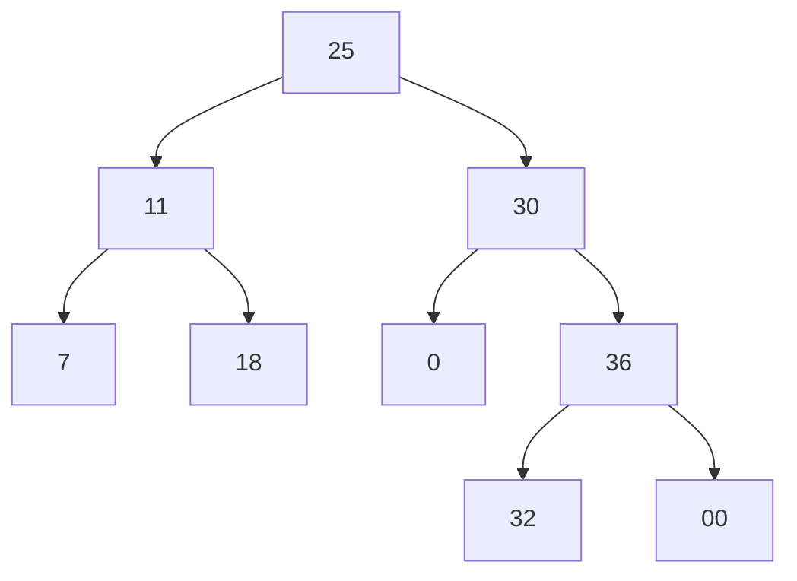
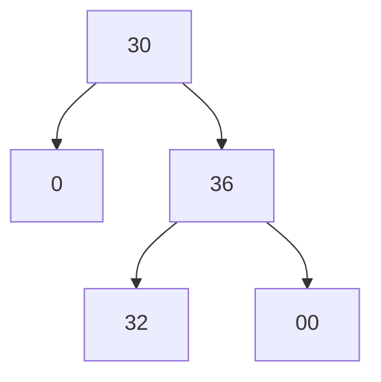
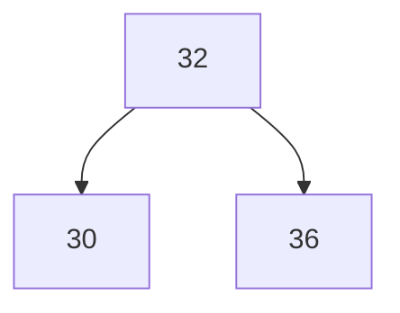

# Arbol Binario de Busqueda

Los subarboles a izquierda tienen clave menor a la raiz y vic para la derecha

#### Arbol balanceado

Para todo Nodo: # de nodos de subarbol izquierdo == \# de nodos de subarbol derecho ± 1

##### 	Nodo Critico

​	{60, 40}

#### Arbol AVL

Para todo nodo: El nivel del subarbol izquierdo == El nivel del subarbol derecho ± 1

##### 	Nodo Critico

​	{60}

## Algoritmo para balancear un Árbol

Seleccionar

+   el nodo crítico a trabajar: El más cercano a la raíz (nodo 60)
+   el nodo que debe quedar como raíz (nodo 40)

### Rotacion a Derecha

### Rotacion a Izquierda

### Combinados

A(25, 11, 30, 7, 36, 18, 32)

Balanceo desde el 30

Como es impar, hay un unico valor medio (32)

cambio la medio por el padre

tantas rotaciones como pasos de diferencia

