# Arbol Binario de Busqueda

Los subarboles a izquierda tienen clave menor a la raiz y vic para la derecha

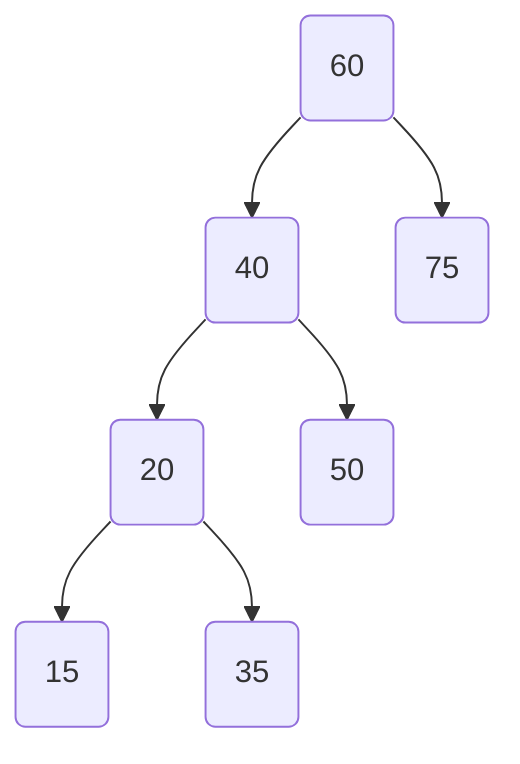

#### Arbol balanceado

Para todo Nodo: # de nodos de subarbol izquierdo == \# de nodos de subarbol derecho ± 1

##### 	Nodo Critico

​	{60, 40}

#### Arbol AVL

Para todo nodo: El nivel del subarbol izquierdo == El nivel del subarbol derecho ± 1

##### 	Nodo Critico

​	{60}

## Algoritmo para balancear un Árbol

Seleccionar

+   el nodo crítico a trabajar: El más cercano a la raíz (nodo 60)
+   el nodo que debe quedar como raíz (nodo 40)

### Rotacion a Derecha

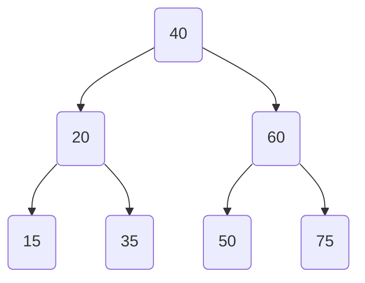

### Rotacion a Izquierda

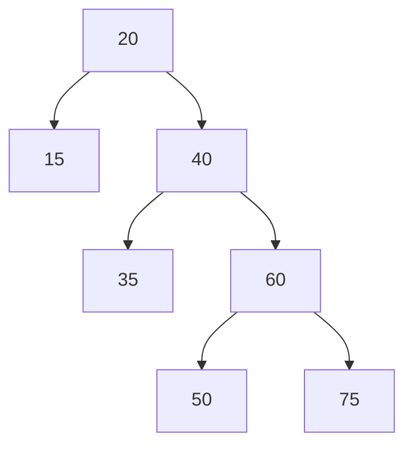

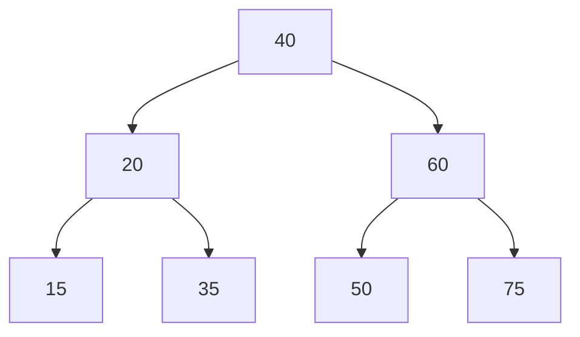
### Combinados

A(25, 11, 30, 7, 36, 18, 32)

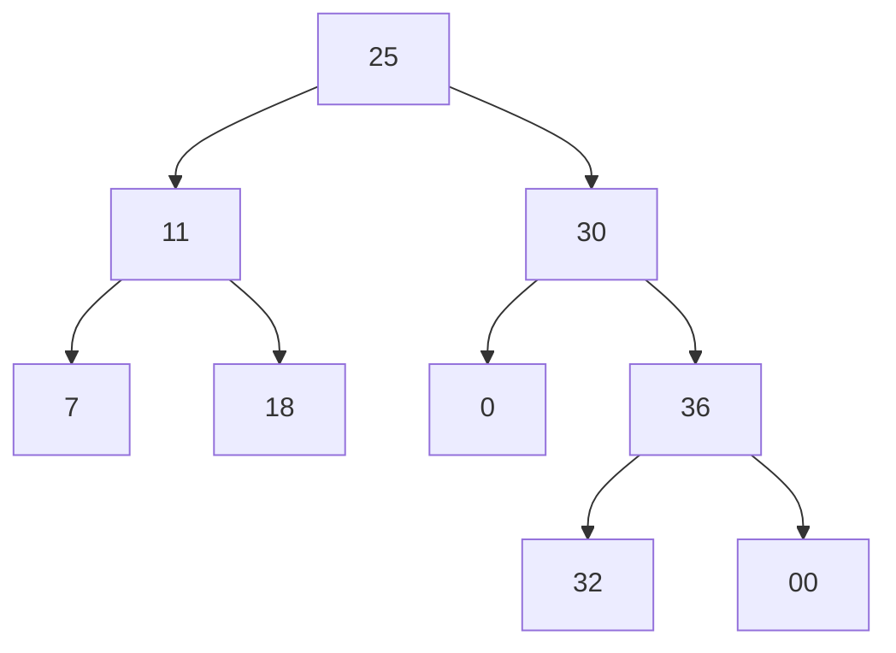

Balanceo desde el 30

Como es impar, hay un unico valor medio (32)

cambio la medio por el padre

tantas rotaciones como pasos de diferencia

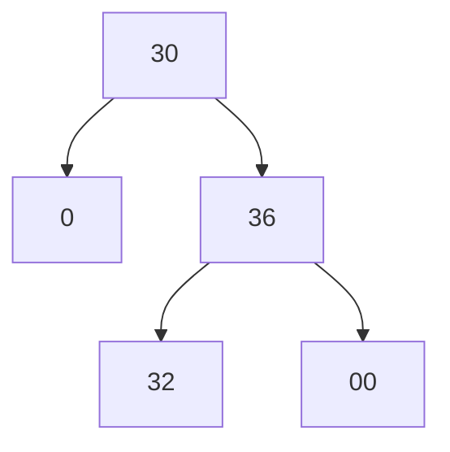

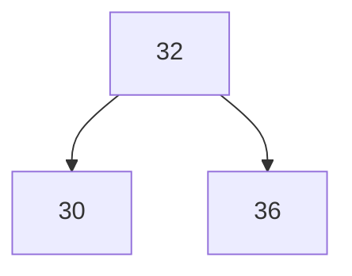

#Algoritmos de ordenamiento

# QuickSort

tomo a[0] y lo comparo contra todos los demas, para que queden menores a izquierda, mayores a derecha.

| ==25== | 11   | 30     | 7      | 36   | ==18== | 32   |
| ------ | ---- | ------ | ------ | ---- | ------ | ---- |
| 18     | 11   | ==30== | 7      | 36   | ==25== | 32   |
| 18     | 11   | ==25== | ==7==  | 36   | 30     | 32   |
| 18     | 11   | 7      | ==25== | 36   | 30     | 32   |

como down y up se unen en 25, ahora lo trabajo recursivamente a las dos mitades

condicion de corte: 2 o + elementos

| 18     | 11   | 7     |
| ------ | ---- | ----- |
| ==18== | 11   | ==7== |
| 7      | 11   | ==18==|

corte???

##### CONTRA

cuando estan mas o menos ordenados, tiene mucho overhead en comparaciones

# HeapSort

busca generar un pseudo orden y despues termina muy rapido

precisa Arbol de orden parcial, para cada subarbol, los hijos son menores al padre (pero OK entre "primos")

+   Carga del Arbol  (se hace una vez)

+   Ordenamiento (n-1- veces)

| ==25== | 11   | 30   | 7    | 36   | 18   | 32   |
| ------ | ---- | ---- | ---- | ---- | ---- | ---- |
|        |      |      |      |      |      |      |

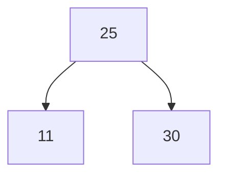
como 30 > 25, cambio
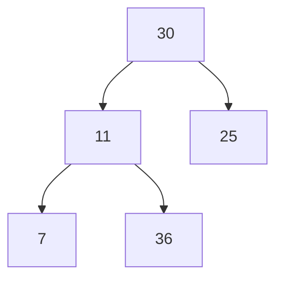
como como 36 > 11, cambio

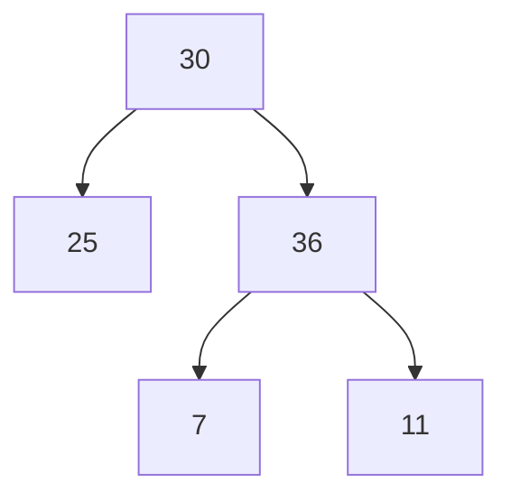
como como 36 >30, cambio

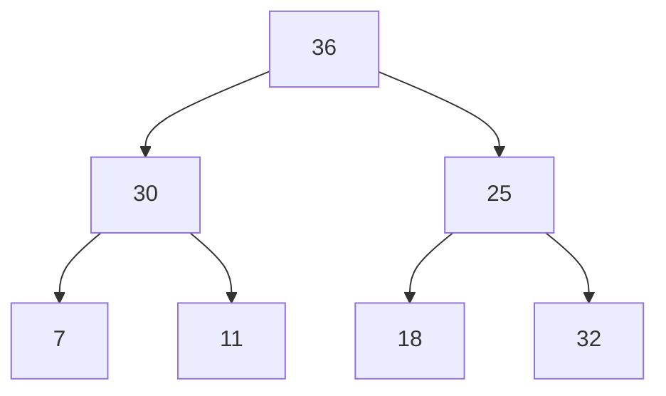
como como 32 >25, cambio

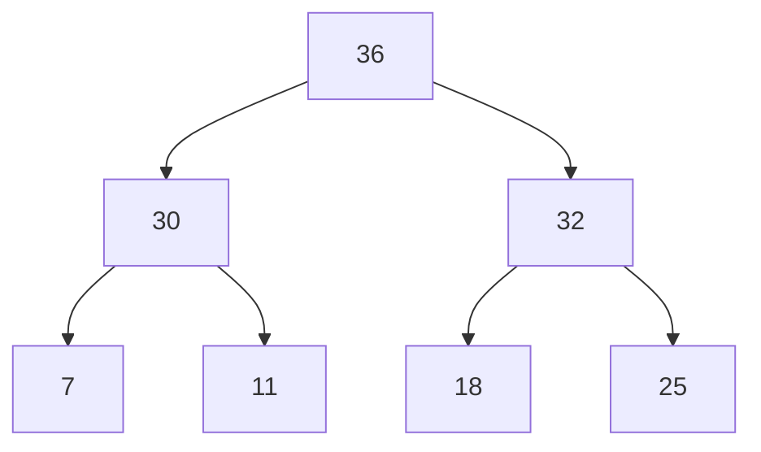

### Implementar arbol en Vector y ordenar

| 36   | 30   | 32   | 7    | 11   | 18   | 25   |
| ---- | ---- | ---- | ---- | ---- | ---- | ---- |
|      |      |      |      |      |      |      |

Ya no cumple el preorden, entonces comparo al 25 (raiz) con sus hijos e intercambio por el mayor

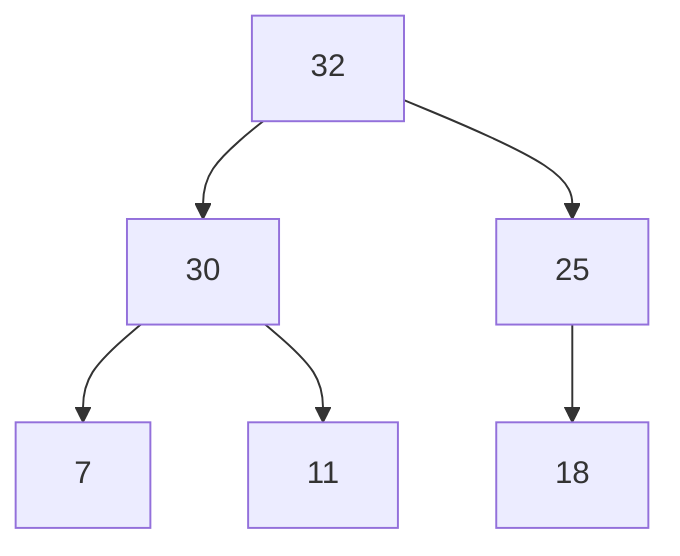

# Implementacion de un arbol en un vector

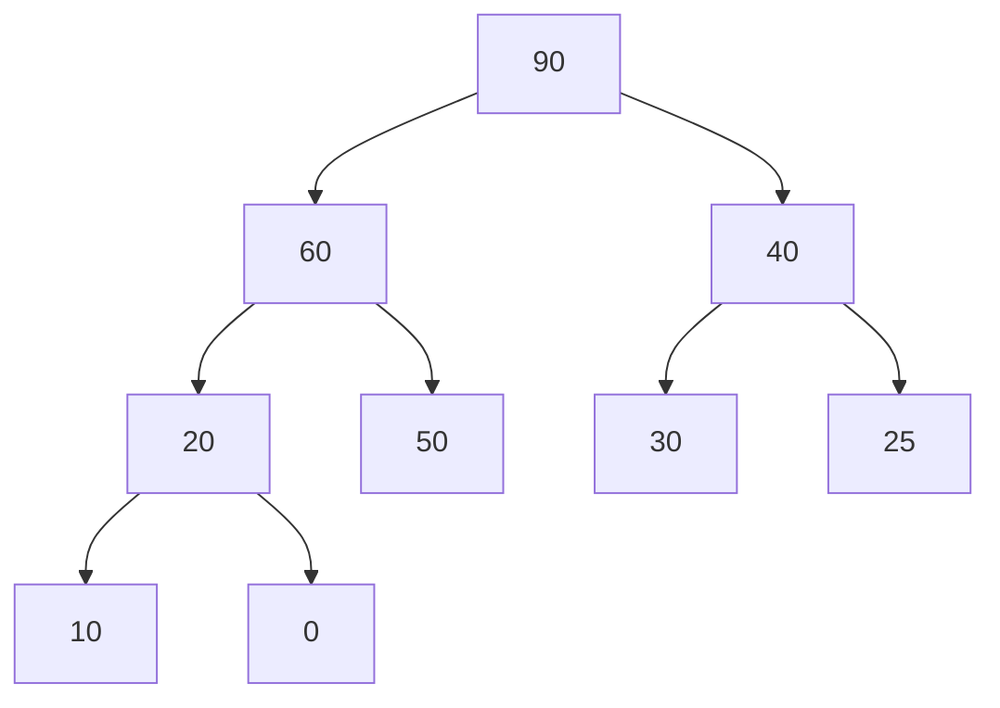
# por niveles

[90|60|40|20|50|30|25|10]

al completarlo por niveles, no quedan huecos

de un array, encontrar sus parientes

Hijo Izquierdo (x) = $((x+1)*2)-1$

Hijo Derecho (x) = $(x+1)*2$

Padre (x) = $ENT[(x-1)/2)]$

Si da overflow, es que no lo tiene. 

# Orden de Complejidad

+   Espacial (memoria)
+   Computacional (procesamiento) 
    +   no contemplamos inicializaciones y declaraciones
    +   analizamos lo recursivo e iterativo
    +   tipos
        +   FIja
        +   Variable

## de Quicksort

Complejidad variable, entre dos funciones

$cota superior:  N + N-1 + N-2 .... ~ N^2 $

$cota inferior : [log_2(n+1)]*n$

La ventaja de quicksort es que las llamadas recursivos se pueden paralelizar

## de Heapsort

Lo pesado es la carga del arbol. Tiene complejidad constante:

$ complejidad: Log_2(n+1)*n $ sin contemplar lo pesado de la carga

Es recursivo Y recurrente (Hasta que no se termina un paso, no puede avanzar el otro - " sincronico")