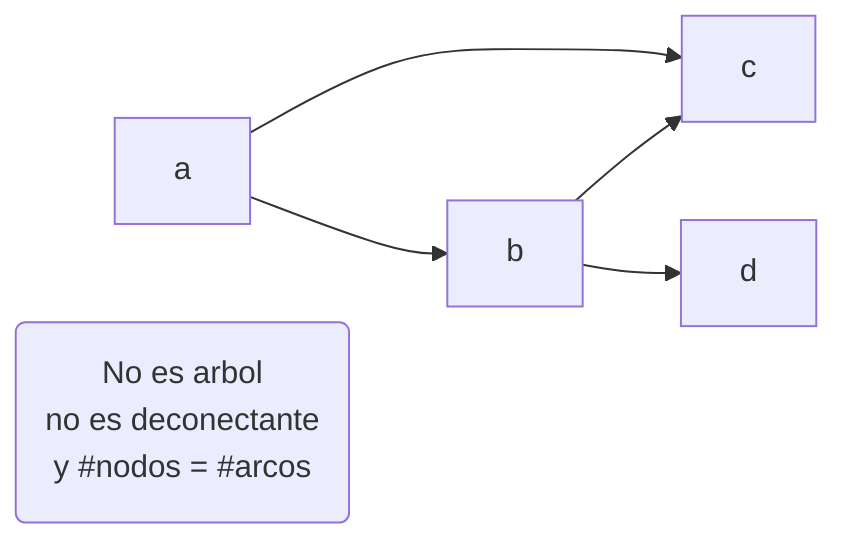
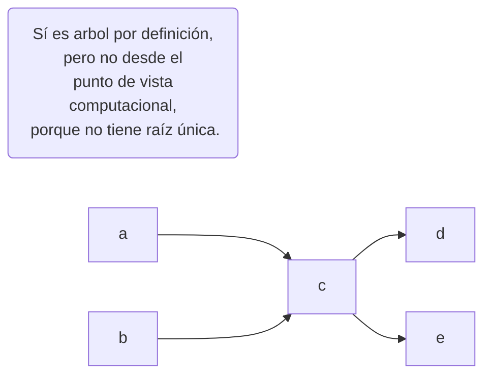
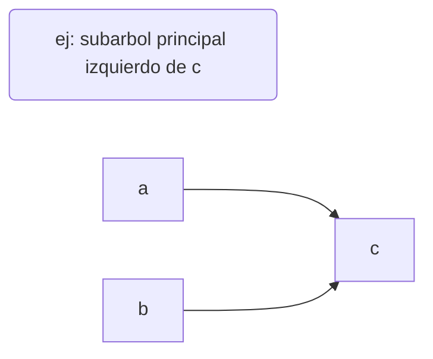
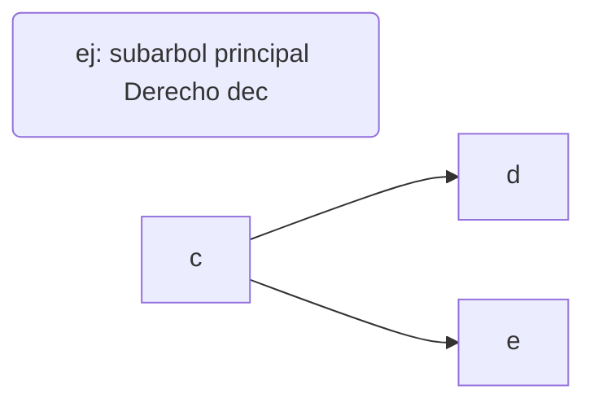
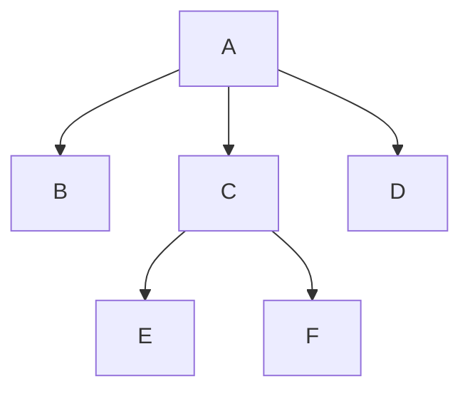
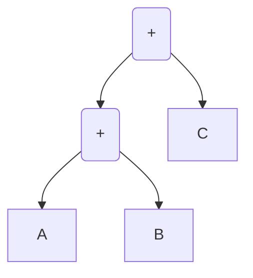
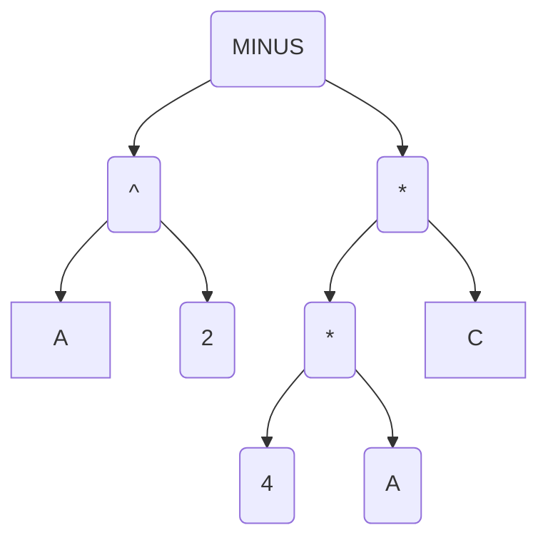
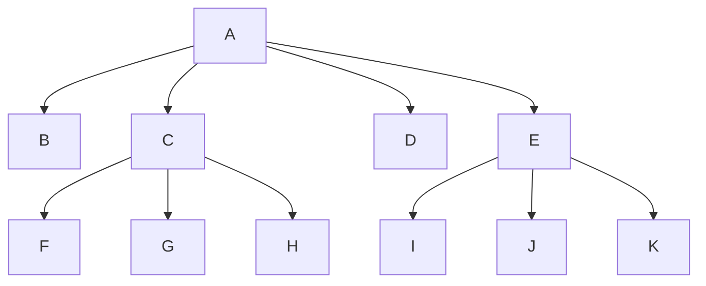
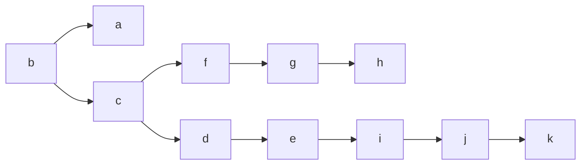

# Estructuras - Arbol Aciclico

1.  Aciclico
2.  \# P (cantidadDeNodos) = #E (cantidadDeArcos) +1 
3.  para Todo Arco  E  :  el Arco es deconectante
4.  Para todo (x, z)  par de nodos  => Existe walk unico entre (x,z)






## Definiciones

**subarbol** subconjunto de nodos que es un arbol en sí mismo

**subarbol principal izquierdo(x)** subarbol que contiene a todos los nodos desde los cuales hay paso.




**subarbol principal Derecho(x)** subarbol que contiene a todos los nodos hacia los cuales hay paso.



**arbol principal izquierdo** Arbol que posee como un único nodo cuyo subarbol ppal izquierdo es todo el árbol
ej: D y E no son arboles principales izquierdos pq no hay paso entre uno y el otro

**arbol principal derecho** Arbol que posee como un único nodo cuyo subarbol ppal derecho es todo el árbol
ej: A y B no son arboles principales derechos pq no hay paso entre uno y el otro

==es el Arbol estandar computacional==

# Arbol Principal Derecho



Caracteristicas:

*   x es minimal => x es unico (raiz)

*   $$
    \forall z \in P / x != z => |L(z)|=1 {\  la\ cardinalidad\ Del\ Left\ Es\ Uno}
    $$

    $$
    => \exists  paso unico (x,z)
    $$

    Grado: Binario / n-ario

    Profundidad(Nodo) = Longitud del paso entre Nodo y la Raiz . (profA = 0, profE = 2)

    Nivel: Profundidad más alta. (2)

    Niveles: Clase de equivalencia de los nodos con igual profundidad.

    ​	{{A},{B,C,D},{E,F}}

    Hojas: conjunto de maximales {B, D, E, F }


## implementaciones

sirven las mismas implementaciones que para grafos y otras mas


### estatica: matriz adyacencia

100 nodos -> 100 * 100 posiciones

​    99 arcos -> 99 posiciones ocupadas

### estatica: matriz incidencia

100 nodos -> 100 * 99 posiciones

​    99 arcos -> 108 posiciones ocupadas

Conclusión: No se usan las implementaciones estáticas para árboles

### Pfaltz

No tiene sentido pq hay siempre una entrante y una salida.

### forma clásica?

```C
struct Nodo {
	...atributos...
	int idNodo
	Nodo* puntero1
... tantos punteros como grado del arbol ...
}

Nodo front; // apunta a la raiz unica
//Esto sirve para arboles de grado estatico
```

### Arbol Expresion

_A + B + C_ (el que usan las calculadoras)



$$
B^2-4AC
$$

### Barridos binarios
```C
struct Nodo {
	int idNodo
	Nodo* izquierdo
    Nodo* derecho
}

Nodo front; // apunta a la raiz unica
```

#### Preorden

```c
// (Raiz, izquierda, derecha)
main {
 	recursivo (front);
}

recursivo (Nodo x){
     if (x is null) RETURN; // CONDICION DE CORTE
     print x->dato;
    recursivo (x->Izq);
    recursivo (x->Der);
}

```
```c
>> - ^ b 2 * * 4 A C
```
#### Simetrico

```c
//izquierda, raiz, derecha
main {
 	recursivo (front);
}

recursivo (Nodo x){
     if (x is null) RETURN;
    recursivo (x->Izq);
    print x->dato;
    recursivo (x->Der);
}

```
```c
>> B^2 - 4*A*C
```


#### PostOrden

```c
//izquierda, derecha, raiz
main {
 	recursivo (front);
}

recursivo (Nodo x){
    if (x is null) RETURN;
 	recursivo (x->Izq);
 	recursivo (x->Der);
    print x->dato;
}

```
```c
>> b 2 ^ 4 A * C * -
```


#### Por Niveles

```c
// raiz, nivel 1 de izquierda a derecha... nivel n de izquierda a derecha
 un vector por cada nivel y recursividad

```
```c
>> - ^ * b 2 * c 4 A
```
### Barridos N-arios



#### Preorden: 

Raiz, H1... Hn

```c
>> A B C FGH D E IJK
```
#### Simetrico

no existe

#### PostOrden

H1... Hn, Raiz

```c
>> B FGH C D IJK E A
```

#### Por Niveles

Igual que el Binario

```c
>> ABCDEFGHIJK
```

#### 

## Arbol Completo

Todos los nodos que no son hojas tienen sus punteros completos.

arbol es completo si para todo nodo que no es hoja, tiene igual grado de salida


#### Implementacion KNUTH

Permite arboles de grado variable.


```c
struct Nodo {
    Nodo* padreReal; //real : no depende de la implementacion
    int idNodo;
    Nodo* primerHijo;
    Nodo* Hermano;
    ...atributos...
}

Nodo* front; // apunta a la raiz
```



Puedo calcular el orden del arbol original con un barrido en PreOrden.


