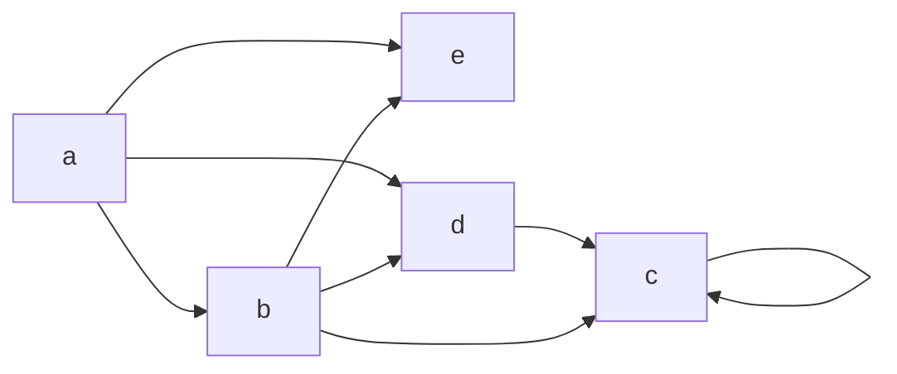
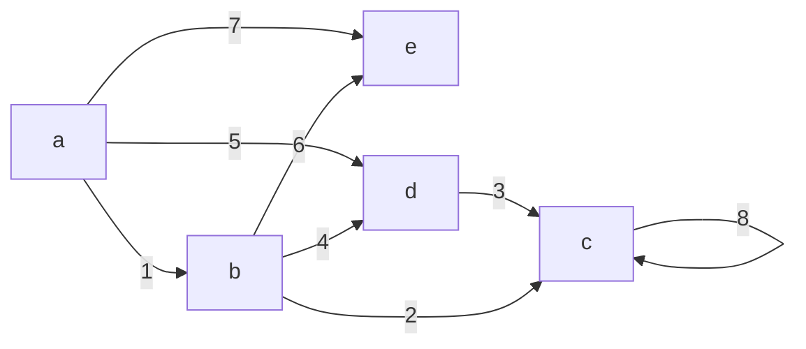
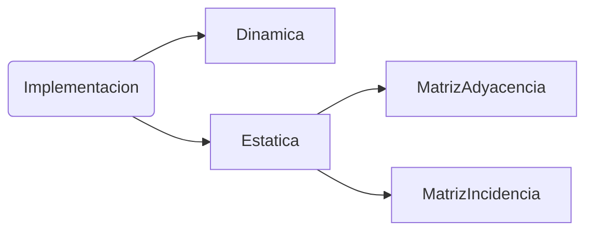
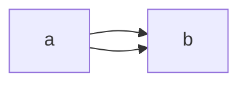
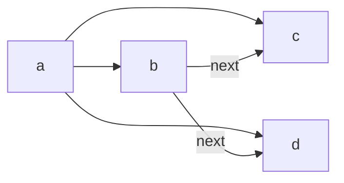
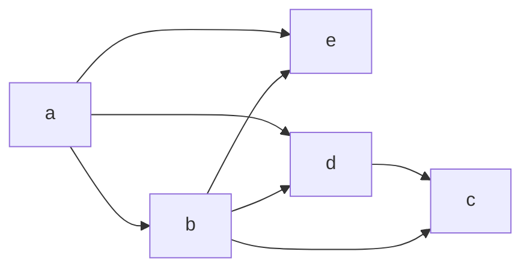
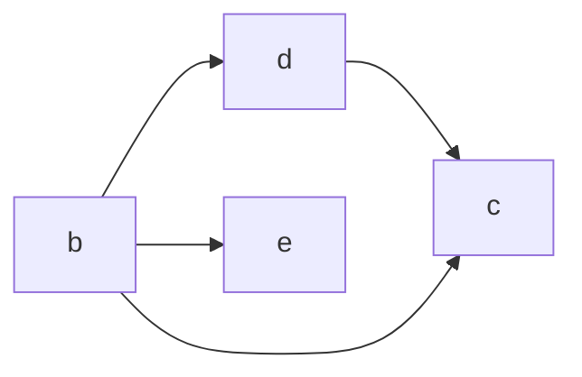
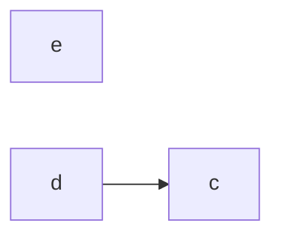
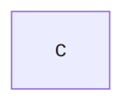

# Estructuras - Grafos


### Definiciones
**Maximal**: conjunto de nodos desde los cuales no parte ningún arco que llega a otro nodo. 
**Maximal**: conjunto de nodos hacia los cuales no llega ningún arco que venga de otro nodo. 

**grado**: cantidad de arcos salientes. El mayor de los grados determina el grado del grafo.
**right?node**: conjunto de nodos hacia los cuales llega un arco que sale del nodo
**left?node**: conjunto de nodos desde los cuales parte un arco que llega a ese nodo
**paso/camino** entre X e Y, existe si se puede llegar de X a Y. Siempre existe entre un nodo en sí mismo.
**longitud de un paso**, cantidad de arcos. 
**Ideal Derecho** Conjunto de nodos hacia los cuales hay paso.
**Ideal Izquierdo** Conjunto de nodos desde los cuales hay paso.
**walk** Paso no direccionado.

Maximales: {C,E}
Minimales: {A}
Grados: C = 1, B = 3, ... grafo = 3
Long(a, d)= puede ser A -> B -> D = 2
Long(a, d)= puede ser A -> D = 1
Hay Walk de D a B y de B a D, pero no entre D y E

### Implementaciones Para memoria




estaticas: ocupan mucho espacio (porcentaje de ocupacion) pero puedo acceder a cualquier nodo de forma directa. 

#### Matriz Adyacencia
|      | A    | B    | C    | D    | E    |
| ---- | ---- | ---- | ---- | ---- | ---- |
| A    | 0    | 1    | 0    | 1    | 1    |
| B    | 0    | 0    | 1    | 1    | 1    |
| C    | 0    | 0    | 1    | 0    | 0    |
| D    | 0    | 0    | 1    | 0    | 0    |
| E    | 0    | 0    | 0    | 0    | 0    |

Problema:

- No puede haber mas de un arco entre dos nodos.

* Porcentaje de ocupacion: 8/25 

#### Matriz Incidencia
1 inicio 2 destino, 3 loop

|      		| A    | B    | C    | D    | E    |
| ---- 		| ---- | ---- | ---- | ---- | ---- |
| alpha1    | 1    | 2    | 0    | 0    | 0    |
| alpha2    | 0    | 1    | 2    | 0    | 0    |
| …    		| …    | …    | …    | …    | ...  |
| alpha8    | 0    | 0    | 3    | 0    | 0    |

* Porcentaje de ocupacion:  8/40


#### Forma Dinámica

//ej para grado 3:

```c
struct Nodo {
	long idNodo
//la cantidad de punteros es estatica, si cambia el grado, necesito otro struct
	Nodo* puntero1 
	Nodo* puntero2
	Nodo* puntero3
???	Nodo* next
}
```
#### Pfaltz

para cada nodo, una lista con todos los arcos, y un puntero al primero. cada uno apunta al siguiente.
lista de arcos salientes y otra de arcos entrantes, en simultaneo

```c
struct Nodo {
	... atributos... 
	int idNodo
	Arco* ledge // primer arco entrante
	Arco* redge // primer arco saliente
	Nodo* next
}

struct Arco {
	... atributos ... // atts. de la relación
	int idArco
	Nodo* lPoint // puntero a nodo A
	Nodo* rPoint // puntero a nodo B
	Arco* lLink //próxima relación ?saliente?
	Arco* rLink //próxima relación ?entrante?
	Arco* next
}
```

**Nodos**

|       | Nodo A | Nodo B | Nodo C | Nodo D | Nodo E |
| ----- | ------ | ------ | ------ | ------ | ------ |
| lEdge |        | x1     | x2     | x4     | x6     |
| rEdge | x1     | x2     | x8     | x3     |        |

**Arcos**
|        | x1   | x2   | x3   | x4   | x5   | x6   | x7   | x8   |
| ------ | ---- | ---- | ---- | ---- | ---- | ---- | ---- | ---- |
| lPoint | A    | B    | D    | B    | A    | B    | A    | C    |
| rPoint | B    | C    | C    | D    | D    | E    | E    | C    |
| lLink  |      | x3   | x8   | x5   | x7   | x7   |      |      |
| rLink  |      | x4   |      | x6   |      |      |      |      |

### Implementaciones Para DB Relacional

| Aeropuertos | Vuelos                    |
| ----------- | ------------------------- |
| idAer       | idVuelo                   |
| Nombre      | idOrigen (fk Aeropuerto)  |
|             | idDestino (fk Aeropuerto) |

```sql
Select * from Aeropuestos o, Aeropuertos d, Vuelos v
where v.origen = o.idAer AND v.destino = d.idAer
```

**NEO4J** es una BD orientada a grafos


## Algoritmos

### Sort Topologico

??? como se ejecutarian las tareas si las hiciera una sola persona.

*requisitos:* grafo aciclico y sin loops




1.  buscar minimales

2.  agregar minimales a listas

3.  eliminar nodos del grafos 

    como es destructivo, debo hacer copia y trabajar sobre ella


minimal: A



[A]

minimal: B



[A, B]

Minimales: E, D

[A, B, E, D]

[A, B, D, E]


Minimal: C

[A, B, E, D, C]

[A, B, D, E, C]


