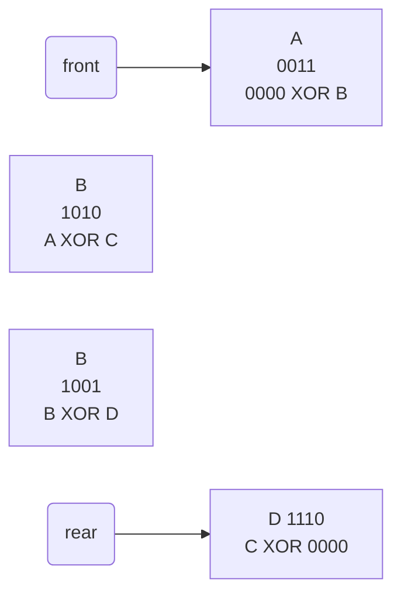
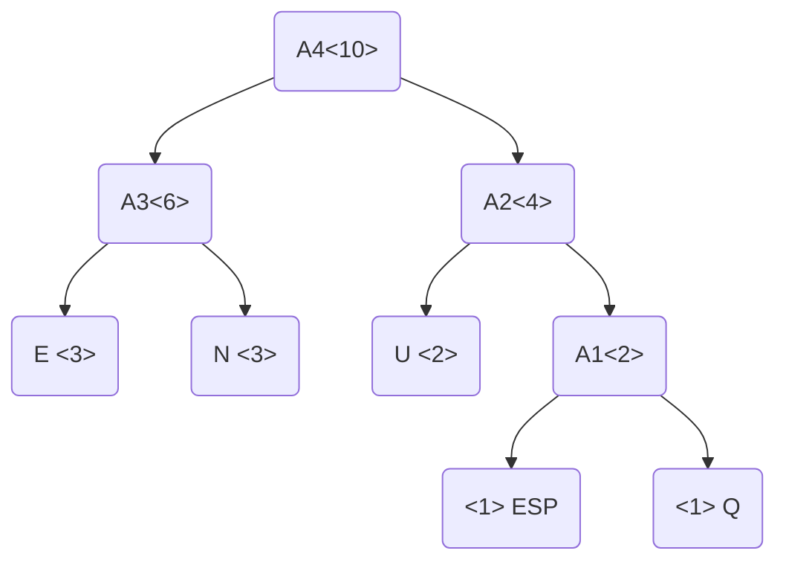

# Siklossy



cuando estoy en  B, tengo en memoria que vine desde A, A XOR C XOR A =

|           | A                 | B              | C              | D                |
| --------- | ----------------- | -------------- | -------------- | ---------------- |
| DIreccion | 0011              | 1010           | 1001           | 1110             |
| XORs      | 1010 (0000 XOR B) | 1010 (A xor C) | 0100 (B xor D) | 1001 (C XOR 000) |
|           |                   |                |                |                  |

| P    | Q    | P XOR Q | P XOR Q XOR P |
| ---- | ---- | ------- | ------------- |
| 0    | 0    | 0       | 1             |
| 0    | 1    | 1       | 0             |
| 1    | 0    | 1       | 0             |
| 1    | 1    | 0       | 1             |

# Huffman

Algoritmo de compresión te archivos de texto. (txt, doc...) .

~ 100 caracteres distintos => Evito el asci.

Trabaja sobre el contenido y la metadata del archivo.

~ 45% de compresion

## Elementos

+ Tabla Huffman

+ Arbol binario

+ PIla

+ Archivos

+ Algoritmos
  + de compresión
  + de descompresión


## Compresión

```
en neuquen
```
| FLAG<br/>(en el arbol y<br/> tienen padre) | CARACTER | FRECUENCIA | DIR. ARBOL<br/> apilo desde el hijo <br/>hacia el padre y popeo |
| ------------------------------------------ | -------- | ---------- | ------------------------------------------------------------ |
| 1                                          | E        | 3          | 00                                                           |
| 1                                          | N        | 3          | 01                                                           |
| 1                                          | U        | 2          | 10                                                           |
| 1                                          | ESP      | 1          | 110                                                          |
| 1                                          | Q        | 1          | 111                                                          |
| 1                                          | A1       | 2          |                                                              |
| 1                                          | A2       | 4          |                                                              |
| 1                                          | A3       | 6          |                                                              |
| 1                                          | A4       | 10         |                                                              |


### Armado del arbol

lee de a dos por la frecuencia, de abajo hacia arriba.

Es un arbol binario completo 

cant nodos = cant caracteres/2 + 1

la frecuencia de la raiz = longitud del texto


Celdas:

| DIr Padre  |
| ---------- |
| Caracter   |
| Frecuencia |
| Izq \| Der |


### Armado del archivo

+   cabecera
    +   en ASCII
    +   \# caracteres distintos (5)
    +   tabla de frecuencia original (2 x 5)
        +   columnas caracter/frecuencia
        +   solo para los caracteres reales
+   cuerpo
    +   a nivel byte ( de a 8)
    +   00**01**110**0**
    +   1**00**10**111**
    +   10**00**01==00== (completo con 0)


## Descompresión

al saber la cantidad de caracteres , sé el tamanio de la tabla, y así encuentro el final de la cabecera

armo el arbol en base a la tabla

por la frecuencia de la raiz puedo saber la longitud del texto (y detectar el relleno)

como todos los caracteres son hojas, nunca me puedo "pasar". cuando llego a una hoja, es un caracter real y ahí termino el caracte.r

