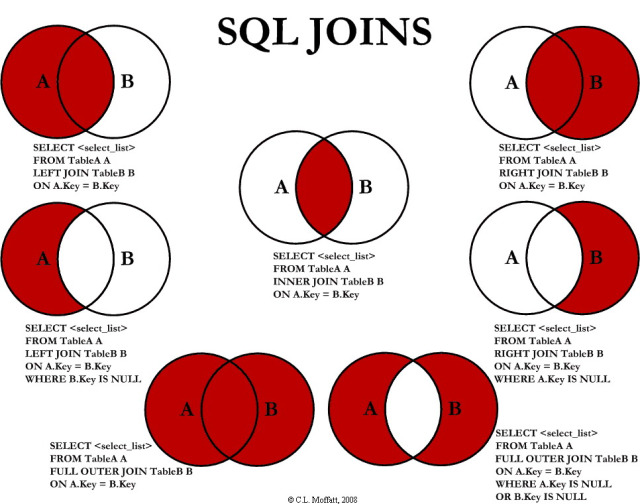

[TOC]

# Arquitectura cliente-servidor

red: nodos (entidades que se comunican) + protocolo + medio + mensajes

## Fisica

+ escalabilidad -> puedo agregar equipos sin "apagar"
+ tolerancia a fallos -> redundancia de servidores
+ alta disponibilidad -> por las anteriores

servidor: da procesamiento  - conectado a storage
clusters de servidores - load balancer (tambien esta balanceado) (round robin / health check - least resources used)

#### Raid
+ Raid 1: info espejada + caro + rapida lectura
+ Raid 5

## Lógica

+ Autorizacion
+ Respuesta al pedido

# SQL
* DML Data manipulation Language - "consultas"
* DDL Data definition Language - "administrar la db."

Motor base de datos: SW que interpreta y responde a mjes en esos lenguajes.
Distintos lenguajes de SQL que vienen de un standar (ANSI SQL).

+ no permite estructuras compuestas

## Ejemplos
```sql
Create table *TABLE* (
ID int not null primary key,
columna *TIPO* [*NULLABLE*]);

Alter table *TABLE* 
add foreign key *FK_NOMBRE* *COLUMNA*
references *TABLA REFERENCIADA(ID)*

Alter table *TABLE* 
drop constraint *FK_NOMBRE*

Drop table *TABLE*

Alter table *TABLE* add *COLUMNA* *TIPO* *[NULLABLE]*
```

## CHECK (Constraints)

```sql
Alter table *TABLA* add constraint *CHECK_COLUMNA* check (len(*COLUMNA*)>n);
Alter table *TABLA* add constraint *UNIQUE_COLUMNA* check (UNIQUE(*COLUMNA*));
```

## SELECT

```sql
SELECT
<campos>, <funciones_escalares>, <funciones_grupo>, <sub_select>, <constantes>, <operaciones>
FROM 
<tablas>, <funciones_tabla>, <vistas>
WHERE
<condicion_bool>
GROUP BY
<condicion_grupo>
HAVING
<condicion_bool>
ORDER BY
<criterio>
```

```sql
Select id_pcia,count(*) from cliente group by id_pcia
```

## funciones de grupo

- sum(num), 

- avg(num), 

- count(campo), count(constante), count(*)

- max(campo)

- min(campo)

  | id   | nombre | id_pcia | f_nac |
  | ---- | ------ | ------- | ----- |
  | 1    |        | 1       | null  |
  | 2    |        | 1       | 1/1   |
  | 3    |        | 2       | 2/2   |
  | 4    |        | 2       | 3/3   |

  ```mysql
  Select id_pcia,count(*),count(f_nac),count(1) from cliente group by id_pcia -- 
  ```

  | id_pcia | count(*) | count(n) | count(f_nac) |
  | ------- | -------- | -------- | ------------ |
  | 1       |          | 1        | null         |
  | 2       |          | 1        | 1/1          |

  count(*) devovleria 0 si todos los registros fueran nulos (solo si no hay PK)

  ```mysql
  Select id_pcia,count(*),count(f_nac),count(1), NOMBRE from cliente group by id_pcia -- ANSI tira error , al agrupar perdes los nombres
  ```

  ## operacion

  ```sql
  Select case when f_nac is null then 'fecha en nulo' else 'fecha OK' END 
  AS fecha_valida -- es el alias, el nombre de la columna. esta va a ir adelante de todo pq la puse primero.
  , * from cliente;
  ```

  #### ejemplo: recuperar PCIA / SEXO

  ```mysql
  Select id_pcia 
  count (case when sexo = 'm' then 1 else null end) as Masc
  sum (case when sexo = 'f' then 1 else 0 end) as Fem -- otra alternativa
  from clientes
  group by id_pcia
  ```

  ## Having

  el where es al select como el having al group by - un "where" filtrando grupos

  ```mysql
  having count(*)>10 or ID_pcia=1 or max(nombre) != 'juan'
  ```

  #### where vs. having - performance

  ```mysql
  Select id_pcia, count(*) from cliente 
  where id_pcia in (1,2,3) -- opcion 1
  group by id_pcia
  having id_pcia in (1,2,3) -- opcion 2
  ```

  el having es mas performante cuando hay pocos excluidos,

  # Atención de pedidos

    1. Análisis Sintáctico 
    2. Análisis Semántico (que los objetos existan)
    3. Analizar y guardar plan de ejecución 
    4. Ejecutar plan de acción
    5. Devolver datos
## plan de ejecucion

- en base al costo (filas, bytes, función de estructuras adicionales (indices), algoritmo (secuencial, dicotomica, acceso directo), cantidad de datos)

- debe llevar estadisticas de las modificaciones a los datos.


## NULL = desconocido

```sql
Select * from cliente where Cliente = NULL --devuelve {}
Select * from cliente where Cliente != NULL --devuelve {}
Select * from cliente where Cliente is NULL
Select * from cliente where Cliente is not NULL
```

|      |      |      |      |
| ---- | ---- | ---- | ---- |
| V    | AND  | NULL | NULL |
| F    | AND  | NULL | F    |
| V    | OR   | NULL | V    |
| F    | OR   | NULL | NULL |
| NULL | AND  | NULL | NULL |
| NULL | OR   | NULL | NULL |

## Join

vincular a traves de algun atributo, dos tablas.



* producto cartesiano: 

  ```sql
  select * from  Tabla1(n registros), Tabla2(m registros) = n*m registros
  ```

  ```sql
  select * from  Cliente c, Pcia p where c.id = p.id_pcia
  --es lo mismo que (sin diferencia de performance)
  select * from  Cliente c join Pcia p on c.id = p.id_pcia
  ```

  ```sql
  --p/ cada pcia, la cantidad de clientes
  select id_pcia, p.nombre, count (*) 
  from Cliente c
  where c.id_pcia = p.id
  group by id_pcia, p.nombre
  -- si hay una pcia sin clientes, no va a aparecer en el listado.
  ```


```mysql
--p/ cada pcia, la cantidad de clientes
select id_pcia, p.nombre, count (*) 
from Cliente c Right Join  Pcia p --aca defino izquierda y derecha
on p.id = c.id_pcia
group by id_pcia, p.nombre
-- va a mostrar las pcias sin clientes, pero va a dar 1 (pq count (*) cuenta los nulos)
```

```mysql
--p/ cada pcia, la cantidad de clientes
select id_pcia, p.nombre, count (id_cliente) 
from Cliente c Right Join Pcia p --aca defino izquierda y derecha
on p.id = c.id_pcia
group by id_pcia, p.nombre
-- va a mostrar las pcias sin clientes, pero va a dar 1 (pq count (*) cuenta los nulos)
```

## Union

Resuleve distintas consultas y lo mete en columnas.  tiene un unico *Order By* al final

### **Union All**

Idem pero trae duplicadas

```sql
 select * from cliente UNION select * from cliente 
 -- = a 
 select * from cliente

```

```sql
 select * from .... where... group by... having...
 UNION ALL
 select * from .....
 
 Order By (1,2,3) -- selecciona la columna
```


## SubSelect 

### Estatico

Muestra el mismo valor en todas las filas.

```sql
select p.*, (select (Max(ID) from cliente)) from pcia p.
```

### Dinámico

el subselect está condicionado al select superior. (el sub ve los campos del super)

```sql
-- muestra el máximo id de cliente para cada pcia
select p.*, (select (Max(ID) from cliente) as Maximo, 
            select MAX(ID) from Cliente c
             where c.id_pcia = p.id
             
-- muestra el máximo id de cliente para cada pcia
select p.*, 
id from cliente  -- rompe pq devuelve todos los clientes, osea más de una tabla, y eso rompe, pq las columnas deben ser unicas
as Maximo, 
select MAX(ID) from Cliente c
where c.id_pcia = p.id
```

### en el from

==no nos lo dejan usar en el parcial==

```sql
select * from (select (Max(ID) from cliente) ...)
```

```sql
select c.id, c.nombre, idp, nombrep from 
	(select c.id, c.nombre, c.id_pcia, p.id AS idp, p.nombre as nombrep 
 	from p 
 	left join cliente c on p.id = c.id_pcia) 
 as pcia_total,
 UNION 
 	(select c.id, c.nombre, c.id_pcia, p.id AS idp, p.nombre as nombrep 
 	from p 
 	right join cliente c on p.id = c.id_pcia) 
 	-- no hacia falta hacer los subselect, el chabon flasheo
```

**pcia_total**

| c.id | c.nombre | idp  | nombrep |
| ---- | -------- | ---- | ------- |
| 1    | juan     | 1    | bsas    |
| 2    | pepe     | 1    | bsas    |
| 3    | marc     | 2    | cord    |
| 4    | null     | null | mza     |

### Over partition

```sql
select id, nombre count(*) over (partition by id_pcia) from cliente
-- es lo mismo que
select id, nombre, (select count(*) from cliente c2 where c2.id_pcia = c.id_pcia1) from cliente c
```

```sql
select id, nombre count(*) over (partition by id_pcia) , row_number over(partition by id_pcia order by nombre DESC) from cliente -- da la tabla
```

| row_number | id   | nombre | id_pcia |
| ---------- | ---- | ------ | ------- |
| 1          | 2    | pepe   | 1       |
| 2          | 1    | juan   | 1       |
| 3          | 3    | marc   | 2       |

```sql
-- numerar filas (version manual del row_number)
select c.id, (select count(*) from Cliente c2 where c.id <= c2.id) from Cliente c
```

### IN

```sql
s* from cliente where id_pcia in (s id from pcia) 
```

### Exists

```sql
s* from cliente where exists (s 1 from pcia p where p.id=c.id_pcia)
-- un poco mas performante que el in
```

### TOP

Devuelve N filas

```sql
select top 50 from ...  where ...
-- resuelve toda la consulta y devuelve las primeras 50 filas.
-- select es de sqlserver, otras son limit
```

### ejemplo

#### x mes y por año, devolver el cliente que mas compró y el monto total vendido, y cantidad de clientes que compraron en un mes

```sql
select month(f.fecha) mes,  year(f.fecha) anio, 
sum(f.monto) monto_total,
    select (TOP(1), f1.cliente_id from cliente c, factura f2
    	where f1.cliente_id = f2.cliente_id
    	and year(f2.fecha) = year(f1.fecha)
    	and month(f2.fecha) = month(f1.fecha)
    	group by (f1.cliente_id)
    	order by (sum(f2.monto) DESC) cliente_copado
	),
	count (distinct f1.id_cliente)
from facturas f1 
group by year(f1.fecha), month(f1.fecha)
```

==@TODO probar de resolver con partitions==

### Otras operaciones

```sql
insert into tabla (c1,..., cn) values (v1,...,vn)
insert into tabla (c1,...,cn) select ... from -- copia entre tablas
update tabla set c1=v1... where <filtro> -- sin el where elimina todas
delete from tabla where .. --idem
select distinct c1, ... cn from ... -- muestra filas distintas (con valores no repetidos)
count distinct 
```

### Ejemplo

#### mostrar 10 productos  mas y menos vendidos

```sql
s * p.nombre from item_factura p
where p.id IN
	select top(10) p_max.id from
	item_factura p_max
	group by p_max.id
	orderby (sum(p_max.cant) DESC)
OR IN
	select top(10) p_max.id from
	item_factura p_max
	group by p_max.id
	orderby (sum(p_max.cant) ASC)
```

==@TODO probar de resolver con partitions==