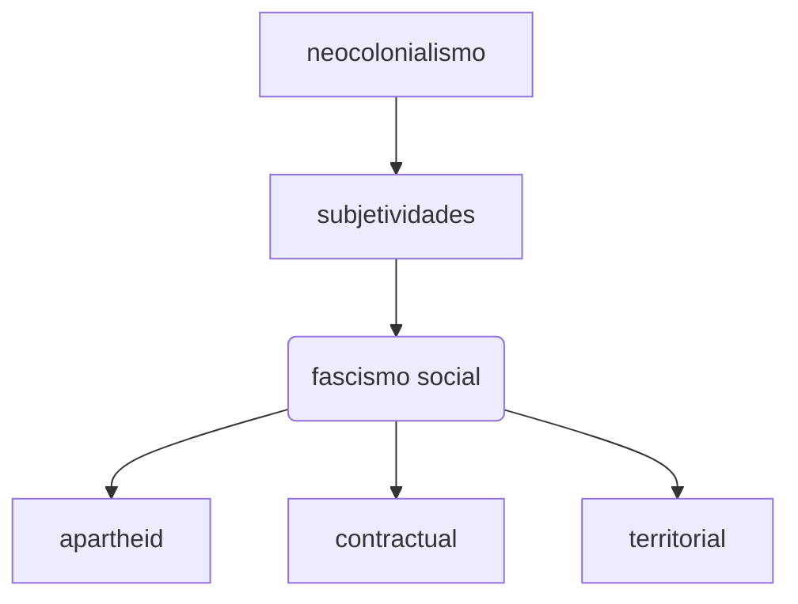
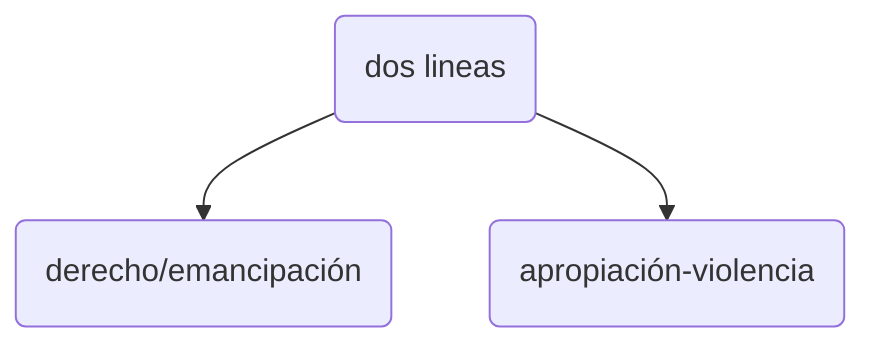

# Pensamiento Abismal

|      | conocimiento                                | normatividad |                                                              |      |
| ---- | ------------------------------------------- | ------------ | ------------------------------------------------------------ | ---- |
|      | indigenismo, pueblos originarios, migrantes |              | Ciencia vs. (filosofia, teologia)  - hay tensión y diálogo.  nutren a la normatividad |      |
|      | apropiación/violencia                       |              | derecho vs. emancipación(revolución francesa)                |      |
|      |                                             |              |                                                              |      |

 ***la ciencia está bajo la matriz del colonialismo***

**Ecologia** *gr. olkos = casa*. 

