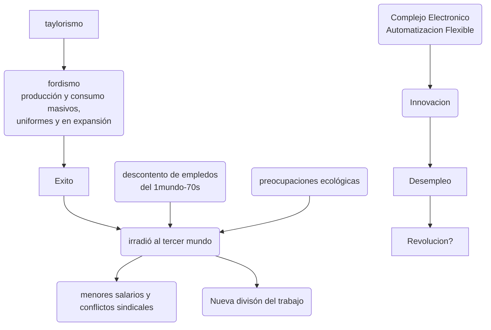

[TOC]

## Parte I

#### 1. Por qué la 1ra R.I se inició en Inglaterra?

sustitición de importaciones de algodón de india. 

telar hidráulico satura la capacidad de los ríos --> máquina de vapor

#### 2. ???Qué rol tuvo la ciencia en los orgígenes de la 1 R.I.?

casi nulo. el flujo fue más bien inverso (de la tec. hacia la ciencia)

pueblo con grandes capacidades técnicas e innovador en la práctica productiva

luego se empezó a buscar en la ciencia soluciones a los problemas técnicos que iban surgiendo.

#### 3. Qué fue lo más relevante en los cambios técnico-productivos? Cuál fue el rol de los factores tradicionales de producción (tierra, trabajo, capital)?

importantes en cuanto a la calidad, no a la cantidad. lo primario fueron la mayor productividad de las nuevas técnicas y una mayor capacidad y experiencia de empresarios y obreros.

#### 4. Diferencia introducida por la máquina de vapor de Watts vs. el de Newcomen?

menos carbón y de velocidad uniforme. surgió de la técnica  y no de la ciencia.

#### 5. Por qué la fábrica construyó un nuevo puente entre innovación e invención? Relación con el sist. de producción de la R.I.

la fábrica pone énfasis sobre la producción y con capacidad de variar los mecanismos y herramientas. Entonces estaban siempre abiertos a mejorar sus ingresos mediante la aplicación de nuevos inventos.

#### 6. Desigual difusión de las innovaciones entre Inglaterra y Continente

Inglaterra prohibió la emigración de artesanos ingleses y de su maquinaria.

#### 7. Rol del estado en ese proceso

*   escuelas técnicas para la formación de ingenieros y mecánicos.
*   orientación y asistencia técnica
*   subvenciones a inventores y empresarios inmigrantes
*   regalos de maquinaria
*   rebajas de impuestos sobre las importaciones de equipo industrial
    *   en los inicios, cuando no se tiene una dirección clara para el avance tecnológico, menor control estatal llevan a más creatividad y diversidad.
    *   cuando se aclara la dirección, el estado dene actuar decididamente para minimizar el atraso.

#### 8. Impacto de la investigación científica en el proceso de industrialización

cuando se logró mayor precisión en la producción de herramientas, se hizo útil la mecánica de Netwon para el diseño de las mismas

#### 9. ???Nuevos elementos de la 2RI

*   química orgánica, productos sintéticos, 
*   máquina de combustión interna
*   cadenas de montaje

*   acero barato (pura ciencia), fabricación de precisión, electricidad: bienes de consumo (relojes, maquinas de coser, bicicletas, electrodomésticos)

#### 10. Impacto de la electricidad en la reorganización de la producción en la 2RI

nuevas posibilidades para la industria artesanal dispersa y pequeños talleres: mueva división del trabajo entre grandes y pequeñás unidades, que pueden complementarse 

#### 11. Mejora sustancial introducida por los desarrollos en química

* materiales nuevos, sintéticos, y baratos
* estimuló y fue estimulado por I+D como actividad propia de la lempresa.

#### 12. Propuesta Taylorista de orgnización del proceso productivo

para tener tiempos uniformes y no depender de la cualificación  de los empleados:

*   descomponer el trabajo  en operaciones simples, que se peudan ejecutar por maquinas manejadas por obrers
*   normalizar la producción para que las piezas del mismo tipo fueran intercambiables y el montaje pueda hacerse rutina

Cadena de montaje: abarata producción y control del proceso de trabajo

El control pasa a la gerencia, en cuanto a la forma y al control y dictado de cada paso del proceso.

#### 13. Explicar desplazamiento de la vanguardia industrial a fines del S XIX, de GB a Alemania

educación elemental 

*   británica: disciplinar a los proletarios para integrarlos a la sociedad. abandona la instrucción técnica en el ámbito publico
*   alemana: da alto valor a la educación. reconocen el valor del ingeniero con base científica.

#### 14. Por qué "el éxito es conservador y contraproducente"

Los ingleses consideraban que, si habían llegado a donde estaban, debían seguir con lo que venían haciendo, y dejaban de innovar.

#### 15. Clima espiritual decimonónico respecto a una visión unificada del mundo y cómo esa imagen se desdibuja. 

#### ???Consecuencias para las políticas científico-tecnológicas

S. XIX: "la estructura fundamental de la teoría científica está asegurada". "quedan pocas cosas por descubrir". "todo puede ser explicado por la cs. "monismo explicativo (todo tiene UNA causa) -> marxismo, economía neoclásica"

la teoría de la relatividad y la cuántica rompen con la idea de  verdad científica. nueva visión historicista de la ciencia: nada es definitivo. 

#### 

### 1er RI

### 2da RI

la 2da rev es una revolucion porque produce un cambio acelerado en el equipamiento tecnologico, en la esturcutra de la sociedad, en las instituciones, y en las condiciones de trabajo de los S.J.

*   maquinas y energía mecánica, 
*   crecimiento del empresariado industrial y del proletariado
*   surge la fábrica y se convierte en el centro de la producción
*   mecanización y fragmentación del trabajo industrial

## Parte II

#### 1. Describa el planteo de Schumpeter respecto de la innovación y los ciclos económicos del capitalismo.

*   dos etapas
  *   empresario individual (distinto al inventor)
      *   origen de la innovación
  *   empresa grande
      *   corriente circular, equilibrio

*   el modo en que las innovaciones aparecen y son absorivdas por el sistema económico explica las revoluciones económicas

*   el capitalismo sufre una evolución: fases/ondas.

*   *en la contracción de predice el fin del capitalismo.*

*   *se agota el sist. productivo y una innovación lo vuelven a impulsar*

    ​					1770 1. rev

    *​						1870 2° rev.*

    *​			imperialismos (busquedas de recursos en las colonias)*

    ​		revolución rusa

    *​	1.gm.*

    *1929 crisis wallstreet: 	descreimiento del modo de vida. crisis del liberalismo[^:liberalismo]*

    ​	Keynes: el estado como protagonista del mercado (evitando el comunismo)

    ​	Fascismo: niega la lucha de clases

    ​						PICO?
    *1970 crisis*

    ​			1980: 3ra rev 

    *					1990: neoliberalismo*
#### 2. Qué muestra el complejo electrónico en lo que respecta a la innovación?

*   contribuciones internacionales
*   flujo de ideas de la ciencia a la ingeniería a los negocios
*   investigación de grupo y financiada
*   rivalidades tencológicas

#### 3. Por qué dice que la electrónica era “demasiado esotérica para permitir empírismos ingenuos”?

demasiado compleja para la casualidad. los inventores tenian fuertes bases cientificas

#### 4. Qué papel jugaron los Estados en el desarrollo de empresas tecnológicas en Gran Bretaña, Alemania, EEUU?

promoviendo y apoyando económicamente a emrpesas como RCA, TElefunken

carrera espacial

#### 5. Qué estrategia llevó a Japón a ocupar un lugar destacado?

Ministerio para la Industria y el Comercio (MITI) promueve formación de los tabajadores e integración de la producción, coordinando empresas, universidades e institutos de investigación

#### 6. Qué características presenta el desarrollo de las computadoras, qué rol juega el mercado, qué peso tuvieron las tareas de desarrollo y las de investigación básica?

matematicos + grants = "calculadora"

2GM - propositos belicos

no se creia que tuviera demanda comercial, pero se vendieron muchs mas de las esperadas

investigacion basica??

#### 7. Cómo trabajaron los laboratorios Bell?

* muchos recursos hacia investigacion básica. 
* invención constante
* inventa el transistor, que necesitó mucho más investigación para que fuera aplicable comercialmente

#### 8.  Qué pronósticos se pueden aventurar por las sucesivas reacciones desencadenadas por el complejo electrónico?

*   la educación se va desplazando hacia afuera de las instituciones formales.
*   desempleo
*   nuevas ocupaciones

#### 9.  Realice una síntesis de la evolución que tuvo el mundo del trabajo desde su reestructuración con el fordismo hasta su superación por lo que podría llamarse  posfordismo.

####  10.  Describa las diferencias entre fordismo y posfordismo

*fordismo: racionalizacion del proceso productivo. division del trabajo intenieros / operarios. presupone una empresa deonde entra materia prima y sale producto terminado (mega empresa)*

*postfordismo(valoracion del factor humano (conocimiento, creatividad, proactividad))*

*autoritarismo post fabril -> proceso mas flexible respecto a logica del mercado quej es muy cambiate. lo rigido del fordismo no puede adaptarse.*

*el modelo fordista es de pleno empleo: condiciones de trabajo abundantes; pero desarrollo de clase media, buena remuneración, pleno empleo*

​    

|                                       | Fordismo                                                     | PostFordismo                                                 |
| ------------------------------------- | ------------------------------------------------------------ | ------------------------------------------------------------ |
| criterio organizador de la producción | oferta de productos estandarizados,maquinaria con propósitos específicos,estandarización, economías de escala | flexibilidaddemanda                                          |
| fundamento competitividad             | precio                                                       | innovación y particularidades del producto                   |
| global vs. individual                 | centro en lo individual (maquina, empresa, trabajador)       | relaciones sitstémicas entre grupostotal quality managment, redes interempresariales... |
| papel del trabajo                     | costo de producción a minimizar                              | recurso con potencial a maximizar                            |

####  11.  Qué se entiende por crisis posfordista del autoritarismo fabril?

se precisa más flexibilidad, las relaciones entre las empresas priorizan calidad, predictibilidad e innovación más que el precio.

antes se buscaba minimizar los sueldos, y se contaba con un ejercito laboral de reserva. 

-   antes
    -   prioriza minimizar precio
        -   minimizar salario
        -   ejercito laboral de reserva
-   ahora
    -   prioriza calidad, estabilidad e innovación
        -   se busca la cooperación y creatividad de la fuerza de trabajo
        -   se le "asegura" la estabilidad del empleo.
        -   minimiza la fragmentación de tareas
        -   capacitación múltiple

#### 12.  Caracterice las rutas posfordistas sueca y japonesa. Qué modelos de innovación sigue  cada una?

| Japón                                                        | Suecia                     |
| ------------------------------------------------------------ | -------------------------- |
| legitimación consensual dela dominación jerárquica (feudalismo) | cooperación, democracia    |
| la empresa da beneficios sociales. neo-kamikazes             | menos efifiencia económica |

####  13.  Por qué considera Arocena que el modelo japonés tiene más potencialidad para imponerse frente al modelo sueco?

alta competencia internacional por precios -> suecia es menos eficiente económicamente.

####  14.  Qué características señala Freeman son las que han llevado a Japón a la vanguardia en sus políticas de innovación?

-   políticas de desarrollo
    -   visión y política a largo plazo parala tecnología
    -   promoción de las tecnologías más avanzadas
    -   70's: desarrollo menos costoso ambientalmente, basado en el conocimiento, con énfasis en IT
-   educación:
    -   alto ratio de jóvenes educados, esp. en ciencia e ingeniería.
    -   gran calidad y escala de capacitación industrial en la empresa
-   social:
    -   abolición de distinciones entre cuello azul y blanco
    -   "ganancias participativas" (bonos)
    -   empleo de por vida
    -   la fuerza de trabajo está muy involucrada
    -   jerarquía pero buenas posibilidades de ascenso social
-   estudios prospectivos muy difundidos y utilizados
-   proyecto nacional de innovación 
####  15.  Qué consideraciones críticas se hacen respecto del desarrollo económico del sudeste asiático? Qué enseñanzas deja?

-   estado intervencionista que implementa política selectiva de sustitución de importaciones, seguida de una liberalización importadora gradual.
-   protección de robrus básicos par aasegurar la autosuficiencia alimentaria
-   resistencia a la organización de los trabajadores: distribución de ingresos regresiva
-   minimiza participación de empresas trasnacionales
-   sede de tercerización por bajos sueldos

####  16 Caracterice el actual paradigma tecno-económico. Qué rol ocupa el procesamiento de información y el factor humano?

*   Freeman: 

    *   desde 1980/1990
    *   tecnologías de información y comunicación. difusión de sus dispositivos.
    *   centralidad de la microelectrónica
    *   producción flexible
    *   economías de rango (lowering average cost by producing more types of products.)
    *   diseño, producción y mercadeo integrados
    *   colaboración entre empresas grandes y pequeñas

*   las ventajas de la I.T. depende de cambios en la organización y desempeño de la gestión, hacia un modelo de máxima eficiencia productiva: un nuevo sentido común.

*   de estructuras piramidales y cerradas a redes planas, interactivas y abiertas de colaboración interdisciplinaria en objetivos no parcelados. 

    *   "inteligencia distribuida"
    *   empowerment

*   diversidad de la producción

    *   producción flexible

    *   formación polivalente de los trabajadores

    *   nuevas colaboraciones intra  y entre empresas, y con sus clientes

####  17.  Qué se entiende por “ventana de oportunidad” ante una transición del paradigma tecno-económico?

* periodo de transición en el que hacer los cambios adecuados en las instituciones y políticas puede llevar a un auge económico.
* nuevas industrias y productos
* adoptar una nueva lógica 
* en los comienzos de una etapa de tecnologías y lógicas de eficiencia, los conocimientos son fácilmente obtenibles, pero luego se obstruyen por patentes, secreto industrial, etc.
* son epocas de crisis

####  18.  ???Reseñe las conclusiones a las que llega el autor en este recorrido histórico por las revoluciones industriales

[^fascismo]: sociedad como un organismo . todas las partes integradas. anti-comunismo. jerarquias, organismos, un equilibrio para la sociedad como un todo. el estado articula la armonia de las partes
[^liberalismo]: inidvidualismo. competencia despiadada 