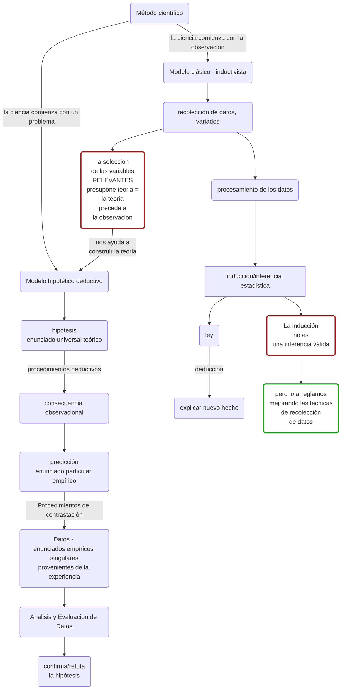
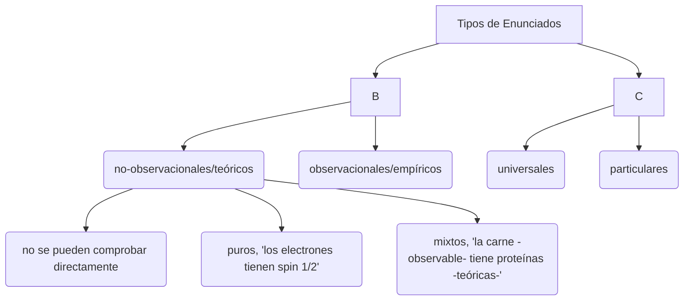
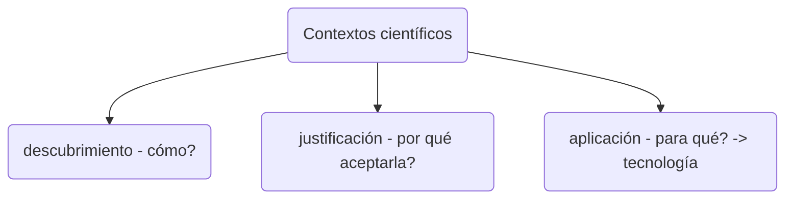
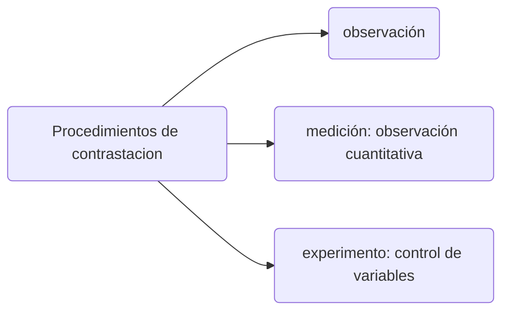
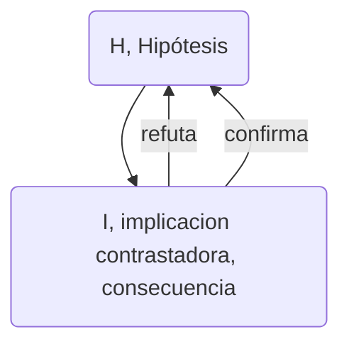
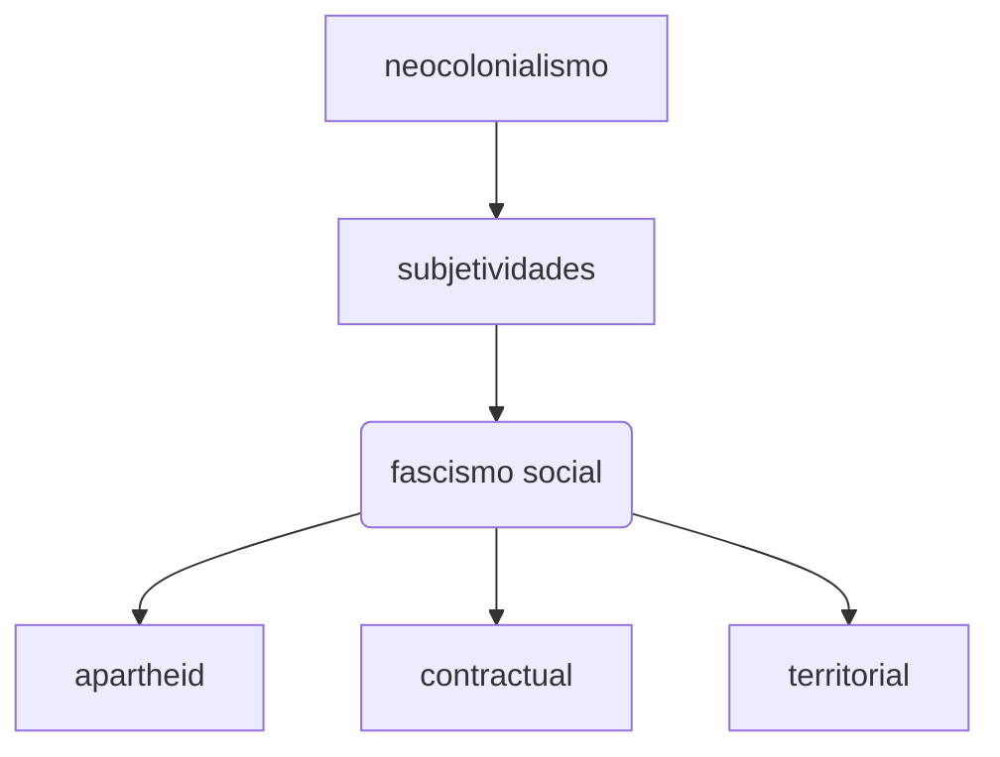
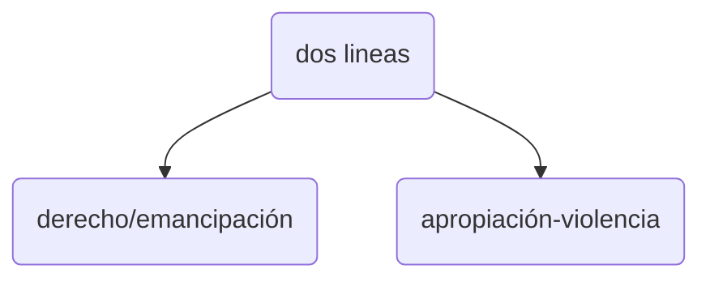

[TOC]

# Diferencias entre conocimiento científico y natural

*Diferencias entre conocimiento científico y natural (comun, vulgar,ordinario) - guia 1 pag. 6* - 11


| C. Cientifico                                                | C. Natural                                                   |
| ------------------------------------------------------------ | ------------------------------------------------------------ |
| **Crítico** (_krino_ pensar... analizar.... discriminar - clasificar - separar en el pensamiento las cosas). SIempre abierto a cuestionar lo previamente aceptado. | **Dogmático** (conocimientos aceptados sin cuestionamiento/justificación - "verdades de fe" - origen del prejuicio) |
| **Objetivo** - ideal inalcanzable  pq la interacción con el objeto de conocimiento transforma al sujeto pero también al objeto.  solo podemos controlar y registrar las modificaciones que se aplican. | **Subjetivo** - dar por sentado que las cosas son "así"      |
| **Sistemático**: los elementos se relacionan por leyes deductivas - tocar una ley afecta a todas las demás. Los conocimientos están trabados lógicamente. permite evaluar la **Consistencia**: ausencia de incompatibilidades. | **Sedimentario**: conviven lso prejuicios con el conocimiento cintífico. No siempre respondemos igual. |
| **Metódico** -  m. hipotético deductivo - línea divisoria entre la ciencia y la no ciencia | **Carente de método propio** - la experiencia, la formación, intuición |
| **Racional** - respeta ciertas reglas preestablecidas (lógica) | **Racional** - si seguimos ciertas reglas, (pero con menos rigor) no podemos ponernos de acuerdo. ej: la no contradicción. |

# Building Blocks

**Concepto**: idea = Significado (el ente "representado") / Significante (la palabra, el "símbolo"). no son V o F.

+ **Ambiguos**: un significante -> 1+ significado.
+ **Vaguedad**: elementos en la zona de frontera.
+ **Definición**: explicitación del significado - expresión de identidad semántica - elimina la ambiguedad, reduce la vaguedad

**Proposición**: predicar algo sobre un sujeto (unión de dos conceptos). El <u>contenido</u> de una enunciación. (V o F)

**Razonamiento**: premisas -> conclusión (vínculo necesario - válido (deductivo): premisas verdaderas, SIEMPRE conclusión verdadera)

* Lógica: determina la (in)validez de los razonamientos

# Clasificación de las ciencias

|                                             | Formales                                                     | Fácticas                                                     |
| ------------------------------------------- | ------------------------------------------------------------ | ------------------------------------------------------------ |
| Ejemplos                                    | Matemática, Lógica                                           | * Naturales - física, biología, química- <br />* Sociales - sociología, psicología, economía- |
| Entes (todo sobre lo que se puede predicar) | Ideales (intemporales)                                       | Reales (temporales - evoluciona)                             |
| Proposiciones                               | Analíticas (la afirmación está dicho implicitamente en el sujeto - explicito el sujeto -> siempre verdaderas dentro de su sistema axiomático) | Analíticas Y Sintéticas (amplío el conocimiento - posibilidad de falsedad) |
| Procedimientos                              | Deductivos                                                   | Deductivos, inductivos (Generalización), métodos empíricos   |

Demostrar/verificar para las cs. formales (sin lugar a dudas, definitivamente). las fácticas <u>muestran</u>

==correccion==: pag 7 item 6: *"el conocimiento es ~~verificable~~ contrastable"* - no existe verdad unica en ciencias no formales.

pag 17


## métodos de las ciencias sociales. 

*   hermenéutica ~ interpretación ~ comprender != explicar
*   método fenomenológico: descripción de los fenómenos, el conocimiento surge desde la descripción
    *   fenómeno (*gr. phaino : brillar, aparecer*): lo que se muestra =! lo que es
*   semiótica: estudio/análisis de los signos => los signos aportan significados

**contrastable/comprobable:** que se puede comprobar empíricamente (por experiencia)

## Para Aristóteles

clasificación ciencias: (*episteme*: saber fundamentado)

**teóricas** (*theorin*: ver, contemplar - actividad contemplativa , las más sublime, nos hace libres)

​	ej: física, folosofía

**prácticas** (*praxis*: acción que se resuelve sobre sí mismo - me transformo como ser humano)

​	ej: etica, politica (es la primera, encauza a todas las demás)

**productivas** (*poiesis*: algo que produce algo distinto de sí mosmo (arte-facto))

​	ej: medicina, ingenierías

**etica** (*ethos* - griego - modo de ser, constumbre) obrar reflexivo (frente a *"dilemas"*)

**moral** (*mos-mores* - latin- modo de ser, constumbre) obrar espontáneo - no reflexivo


# Clasificación de Problemas

### **problema:** 

*   vacío del marco teórico. requiere investigación. 
    *   **marco teórico:** conjunto de conocimientos aceptados (probados) por la comunidad científica (en los libros, papers)
*   teórico-dependiente (desajuste entre el modelo y la realidad - la realidad no tiene problema :P)

	### 	**hipótesis:**

*   libres creaciones del intelecto humano.

*   "responden" el problema

*   enunciados universales teóricos


1)  Según el modo de resolución

|                | Lógicos   | Teóricos                           | Pŕacticos([Técnicas](#tecnica))                              |
| -------------- | --------- | ---------------------------------- | ------------------------------------------------------------ |
| **Resolución** | algoritmo | hipótesis                          | diseño                                                       |
| **Ciencias**   | formales  | fácticas (ej. quimica) - ¿por qué? | tecnologías (ingeniería, bioingeniería) - ¿cómo? ¿qué? - modificar una situación a partir de una necesidad/deseo. |
| **Evaluación** |           | verdad                             | utilidad<br />[prudencia](#prudencia)                        |

##### prudencia

*   no generar nuevos problemas.
*   *Aristoteles: virtud ética* - poder distinguir el bien del mal.


##### tecnica

*gr. techné: saber hacer*

*   artes bellas

*   artes útiles

# Técnica  vs. tecnología

|                      | Técnica              | Tecnología    |
| -------------------- | -------------------- | ------------- |
| tipo de conocimiento | empírico             | científico    |
| producción           | artesanal            | industrial    |
| ser humano           | consustancial        |               |
| transmisión          | individual (maestro) | institucional |


# Método Científico

guia pagina 12




### Tipos de Enunciados



### Contextos científicos



### Procedimientos de contrastación



### inferencia científica

implicación lógica

vs

implicación material/condicional (si...entonces) es un operador. si al aplicar el operador da tautología, hay implicación lógica

un razonamiento es válido(deductivo) cuando las premisas IMPLICAN a la conclusión.



```mathematica
//CONFIRMACION
H -> I && I
----
H // falacia de afirmacion del consecuente	

//REFUTACION
H -> I && -I
----
-H // modus tollens (contra reciproco)

//puedo ir de lo universal a lo particular, pero no de lo teorico a lo empirico. uso el marco teorico, son hipotesis que unifican lo empirico con lo teorico, los enunciados mixtos.

(H&A) -> I && -I
----
-(H&A) // entonces quizas falla A, la hipotesis auxiliar
```


# Pensamiento Abismal

|      | conocimiento                                | normatividad |                                                              |      |
| ---- | ------------------------------------------- | ------------ | ------------------------------------------------------------ | ---- |
|      | indigenismo, pueblos originarios, migrantes |              | Ciencia vs. (filosofia, teologia)  - hay tensión y diálogo.  nutren a la normatividad |      |
|      | apropiación/violencia                       |              | derecho vs. emancipación(revolución francesa)                |      |
|      |                                             |              |                                                              |      |

 ***la ciencia está bajo la matriz del colonialismo***

**Ecologia** *gr. olkos = casa*. 





==comprar==

Gianella, Alicia, Intro a la Epistemología y metodología de la ciencia. bs,as, edulpt 2003 pags. 84 -102

# Estudiar
unidad 1
unidad 2 pag 1-16
Boaventura
Gianella
