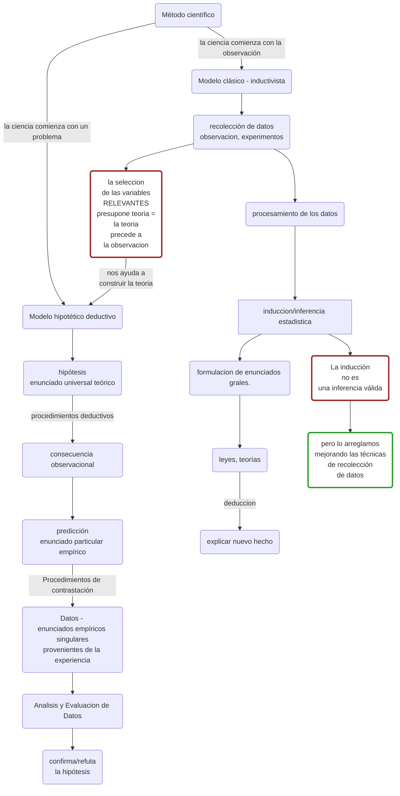
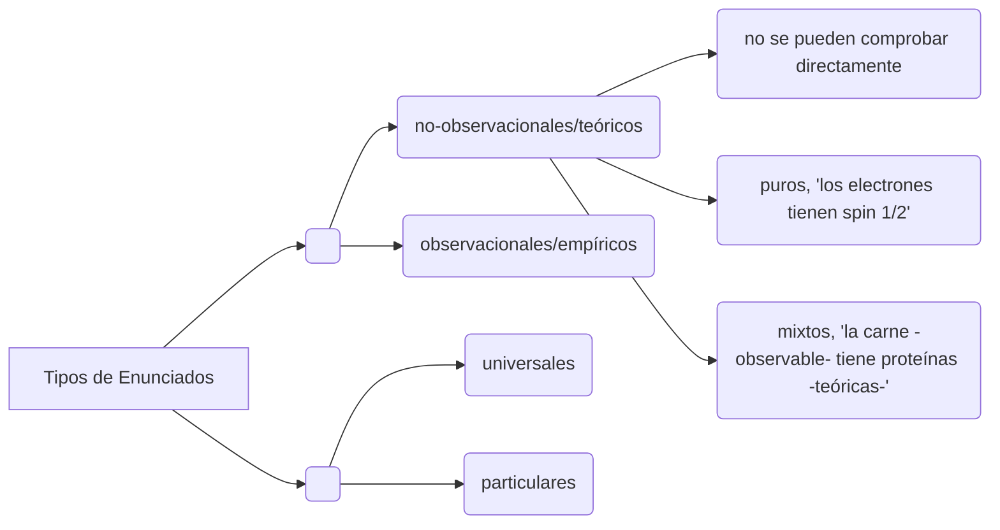
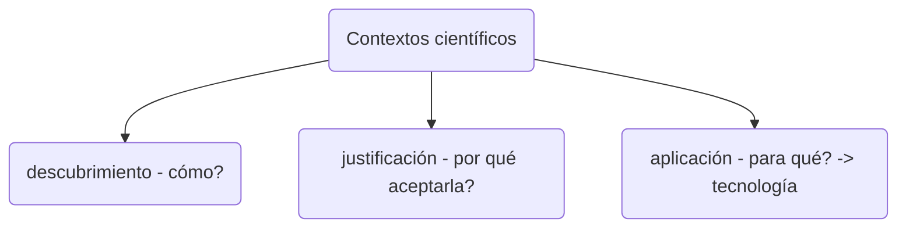
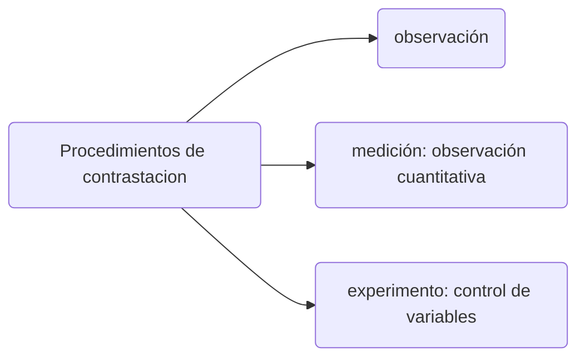
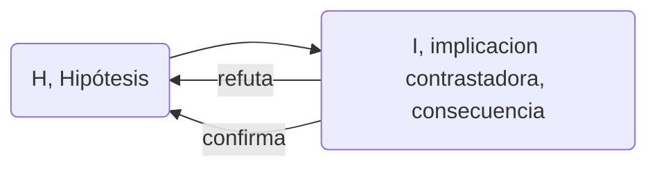

[TOC]

# Clasificación de conocimientos[^+]


| C. Cientifico                                                | C. Natural                                                   |
| ------------------------------------------------------------ | ------------------------------------------------------------ |
| **Crítico** (_krino_ pensar... analizar.... discriminar - clasificar - separar en el pensamiento las cosas). Siempre abierto a cuestionar lo previamente aceptado. | **Dogmático** (conocimientos aceptados sin cuestionamiento/justificación - "verdades de fe" - origen del prejuicio) |
| **Objetivo** - ideal inalcanzable  pq la interacción con el objeto de conocimiento transforma al sujeto pero también al objeto.  solo podemos controlar y registrar las modificaciones que se aplican. | **Subjetivo** - dar por sentado que las cosas son "así"      |
| **Sistemático**: los elementos se relacionan por leyes deductivas - tocar una ley afecta a todas las demás. Los conocimientos están trabados lógicamente. permite evaluar la consistencia [^Consistencia] | **Sedimentario**: conviven lso prejuicios con el conocimiento cintífico. No siempre respondemos igual. |
| **Metódico** -  m. hipotético deductivo - línea divisoria entre la ciencia y la no ciencia | **Carente de método propio** - la experiencia, la formación, intuición |
| **Racional** - respeta ciertas reglas preestablecidas (Lógica[^Lógica]) | **Racional** - si seguimos ciertas reglas, (pero con menos rigor) no podemos ponernos de acuerdo. ej: la no contradicción. |
| **Indirecto** - requiere conocimientos anteriores            |                                                              |
| **Construcción social**                                      |                                                              |
| Busca construir **enunciados verdaderos**                    |                                                              |
| **Comprobable/verificable**                                  |                                                              |

| hoa  |      |      |
| ---- | ---- | ---- |
|      |      |      |
|      |      |      |
|      |      |      |


# Términos de Lógica [^Lógica]

**Concepto**: idea = Significado (el ente "representado") / Significante (la palabra, el "símbolo"). no son V o F.

+ **Ambiguos**: un significante -> 1+ significado.
+ **Vaguedad**: elementos en la zona de frontera.
+ **Definición**: explicitación del significado - expresión de identidad semántica - elimina la ambiguedad, reduce la vaguedad

**Proposición**: predicar algo sobre un sujeto (unión de dos conceptos). El <u>contenido</u> de una enunciación. (V o F)

**Razonamiento**: premisas -> conclusión (vínculo necesario - válido (deductivo): premisas verdaderas, SIEMPRE conclusión verdadera)

[^Lógica]: determina la (in)validez de los razonamientos

# Clasificación de las ciencias

## Formales/Fácticas

|                                             | Formales                                                     | Fácticas                                                     |
| ------------------------------------------- | ------------------------------------------------------------ | ------------------------------------------------------------ |
| Ejemplos                                    | Matemática, Lógica                                           | * Naturales - física, biología, química- <br />* Sociales - sociología, psicología, economía- |
| Entes (todo sobre lo que se puede predicar) | Ideales (intemporales)                                       | Reales (temporales - evoluciona)                             |
| Proposiciones                               | Analíticas (la afirmación está dicho implicitamente en el sujeto - explicito el sujeto -> siempre verdaderas dentro de su sistema axiomático) | Analíticas Y Sintéticas (amplío el conocimiento - posibilidad de falsedad) |
| Procedimientos                              | Deductivos                                                   | Deductivos, inductivos (Generalización), métodos empíricos   |

Demostrar/verificar para las cs. formales (sin lugar a dudas, definitivamente). las fácticas <u>muestran</u>

**contrastable/comprobable:** que se puede comprobar empíricamente (por experiencia)

==correccion==: pag 7 item 6: *"el conocimiento es ~~verificable~~ contrastable"* - no existe verdad unica en ciencias no formales.


## Básicas/Industriales

comparten la epistemología y metodología de la ciencia y la actitud investigativa

|                           | Básica/académica              | Industrial                   |
| ------------------------- | ----------------------------- | ---------------------------- |
| motivación                | afán de conocer               | úsos útiles del conocimiento |
| conocimiento              | público, libre, desinteresado | privado                      |
| cuadros                   | prepara los propios           | reclutados                   |
| reglas de ascenso         | propias                       | gerencial                    |
| responsabilidad educativa | sí                            | no                           |

### Ciencia colectivizada:

Por el costo de los instrumentos y edificios, y la demanda por parte de la sociedad.

*   en equipo y en instituciones

*   instrumental complejo y costoso

*   comunidad de científicos en transformación, por el trabajo en organizaciones, coordinado y dirigido

*   proyectos justificados económicamente

*   relaciona la finalidad teórica y aplicada

    ## Ciencia académica vs. Ciencia colectivizada

    |               | Académica                                                    | Colectivizada                                                |
    | ------------- | ------------------------------------------------------------ | ------------------------------------------------------------ |
    | Comunalismo   | conocimiento públic, libre, abierto. Los avances son propiedad de la comunidad. | conocimiento privado                                         |
    | Universalismo | No hay fuentes privilegiadas de conocimiento<br>La objetividad excluye al particularismo y la exclusión | organizaciones jerárquicas                                   |
    | Desinterés    | Ciencia por la ciencia misma                                 | apuntado a la tecnología, objetivos                          |
    | Originalidad  | Descubrimiento de lo desconocido                             | menos autonomía personal en la selección de problemas y métodos |
    | Escepticismo  | Comporbación racional de todo conocimiento<br>Sin límites de exploración | lealtades y doctrinas institucionales <br> Patentes.         |

    ​

## métodos de las ciencias sociales. 

*   hermenéutica ~ interpretación ~ comprender != explicar
*   método fenomenológico: descripción de los fenómenos, el conocimiento surge desde la descripción
    *   fenómeno (*gr. phaino : brillar, aparecer*): lo que se muestra =! lo que es
*   semiótica: estudio/análisis de los signos => los signos aportan significados


## Aristóteles

fue el primre epistemólogo[^episteme] - se ocupó de la fundamentación del conocimiento, y de formular reglas metodoloógicas.


#### clasificación de las ciencias 

| Teóricas | Prácticas | Productivas |
| -------- | --------- | ----------- |
| (*theorin*: ver, contemplar - actividad contemplativa , las más sublime, nos hace libres)         |(*praxis*: acción que se resuelve sobre sí mismo - me transformo como ser humano)           | (*poiesis*: algo que produce algo distinto de sí mismo (arte-facto))            |
| ej: física, folosofía         | ej: etica[^etica], politica (es la primera, encauza a todas las demás) |  ej: medicina, ingenierías           |
## Galileo

*   requerimiento de experimentación continua

*   reducción del mundo de la experiencia a su estructura matemática

*   razonamiento hipotético deductivo

    ​

# Clasificación de Problemas

## problema 

*   vacío del marco teórico. requiere investigación. 
    *   **marco teórico:** conjunto de conocimientos (teorías y supuestos paradigmáticos) aceptados (probados) por la comunidad científica (en los libros, papers). a veces se usan varios marcos teóricos en forma parcial (ej. enfoque interdisciplinario). 

*   teórico-dependiente (desajuste entre el modelo y la realidad - la realidad no tiene problema :P)

*   componentes:

    *   quien interroga
    *   contenido de la pregunta
    *   contexto en que se formula - marco teórico - le da sentido.

## hipotesis

*   libres creaciones del intelecto humano. 

*   "responden" la pregunta

*   enunciados universales teóricos

*   se toman como verdaderas provisoriamente y son contrastadas con la realidad.

*   condiciones formales:
    *   formulación clara y sin ambiguedades
    *   definición de los términos
    *   enunciado sintético: contenido empírico. -> falsable

*   establecen relaciones entre los términos que contienen
    *   causales
    *   funcionales
    *   conceptuales
    *   genéticas

*   deben ser relacionarse con el marco teórico mediante la compatibilidad, deducibilidad e implicación, o modificarlo (resistencia de la comunidad científica)

### hipótesis ad-hoc

*   afirmaciones sin apoyo empírico que las justifique 
    *   Algunas sólo se justifican con la aceptación de la H: Procedimiento Circular
    *   Otras podrían ser contrastadas a futuro.


## Según el modo de resolución

|                | Lógicos                                                      | Teóricos                                                     | Pŕacticos(Técnicos [^Tecnica])                               |
| -------------- | ------------------------------------------------------------ | ------------------------------------------------------------ | ------------------------------------------------------------ |
| **Resolución** | algoritmo                                                    | hipótesis                                                    | diseño                                                       |
| **Ciencias**   | formales                                                     | fácticas (ej. quimica)<br>conceptuales - clasificación <br> prácticos - ¿por qué? | tecnologías (ingeniería, bioingeniería) <br> ¿cómo? ¿qué?<br> modificar una situación a partir de una necesidad/deseo. |
| **Evaluación** |                                                              | verdad                                                       | utilidad, éxito, prudencia [^prudencia]                      |
| Metodos        | Axiomatico. demuestran verdades(teoremas) mediante la logica. deductivos | comprobaciones empiricas                                     |                                                              |


# Técnica[^tecnica]  vs. tecnología[^tecnologia]

|                         | Técnica              | Tecnología            |
| ----------------------- | -------------------- | --------------------- |
| tipo de conocimiento    | empírico             | científico + "oficio" |
| producción              | artesanal            | industrial            |
| relacion con ser humano | consustancial        | contingente           |
| transmisión             | individual (maestro) | institucional         |

# Ciencia y tecnología

| Ciencia                            | Tecnología                                                   |
| ---------------------------------- | ------------------------------------------------------------ |
| Plantear problema                  | Problema práctico                                            |
| Formular hipótesis                 | Análisis de alternativas de solución. (diseño de artefactos, sistemas, servicios) |
| Verificar hipótesis                | Prueba de diseños (teóricamente/experimentalmente)           |
| Modificar la hipótesis             | Reajuste del diseño                                          |
| Nuevos problemas y puntos de vista | Evaluar el éxito de la solución                              |


# Método Científico




### Tipos de Enunciados



### Contextos científicos



### Procedimientos de contrastación

##### 	Consecuencias observacionales/contrastables: 

  * enunciados inferidos deductivamente de las hipótesis, suceptibles a la confrontación con la experiencia.

  * formuladas en lenguaje observacional, no teórico

  * se hacen predicciones o se intenta explicar fenómenos ya conocidos.

    #### momentos de los procedimientos experimentales

    1.  Diseño (identificar variables, y cómo variarán)
    2.  Implementación
    3.  Evaluación de resultados




Siempre hay supuestos en las contrastaciones, sobre los elementos de medición, con el uso del lenguaje...

### inferencia científica

implicación lógica

vs

implicación material/condicional (si...entonces) es un operador. si al aplicar el operador da tautología, hay implicación lógica

un razonamiento es válido(deductivo) cuando las premisas IMPLICAN a la conclusión.



```mathematica
CONFIRMACION
H -> I && I
----
H // falacia de afirmacion del consecuente	

REFUTACION
H -> I && -I
----
-H // modus tollens (contra reciproco)


puedo ir de lo universal a lo particular, pero no de lo teorico a lo empirico. uso el marco teorico, son hipotesis que unifican lo empirico con lo teorico, los enunciados mixtos.

(H&A) -> I 
-I
----
-(H&A) = -H | -A // quizas falla H o quizas A, la hipotesis auxiliar. se puede preservar H mientras se reevalua A. Por ejemplo, la veracidad de los datos observacionales.
```


# Estudiar
unidad 1
unidad 2 pag 1-16
Boaventura
Gianella


[^+]: Diferencias entre conocimiento científico y natural (comun, vulgar,ordinario) - guia 1 pag. 6 - 11 ] 

[^consistencia]: ausencia de incompatibilidades.

[^episteme]: saber fundamentado

[^etica]: (*ethos* - griego - modo de ser, constumbre) obrar reflexivo (frente a *"dilemas"*) || (*mos-mores* - latin- modo de ser, constumbre) obrar espontáneo - no reflexivo

[^prudencia]: no generar nuevos problemas. *Aristoteles: virtud ética* - poder distinguir el bien del mal.

[^tecnica]: *gr. techné: saber hacer*, siguiendo ciertas reglas. artes bellas / artes útiles

[^tecnologia]: Conocimiento compatible con la ciencia coetánea que permite usar el método científico y tecnológico y que se emplea para controlar, transformar o crear cosas o procesos naturales o sociales. Diseña  artefactos y planea su realización, operación y mantenimiento.