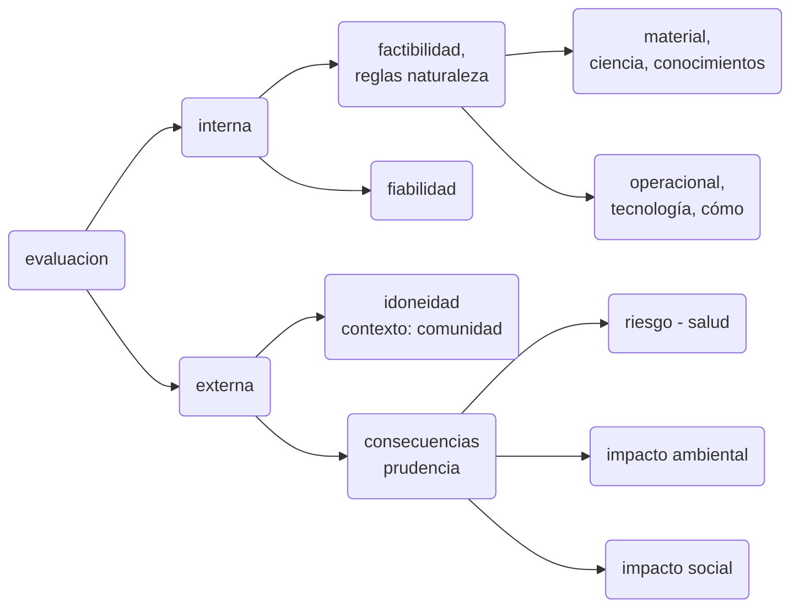

*   investigacion tecnologica
    *   orientada a 
        * invenciones (innovacion).
          *  resolucion de un problema practico mediante la creacion de una nueva tecnica/procedimiento.
        * aplicacion no orientada a algo en particular. universal.
          *   valor: la novedad

          		*radical*: si inaugura un paradigma tencologico nuevo

          	produce un nuevo sentido comun

        * proyectos

          resolucion de un problema practico mediante la combinacion de tecnicas preexistenties.

          resuelve una situacion particular

          valor: el "toque" del ingeniero.

          produce diseño  que se traduce en un prototiopo

innovacion vs. invencion : la innovacion puede quedar en la patente. innovacion: llega a la fabricacion

maquina vapor, quimica, microchips

la tele por ejemplo no es nuevo paradigma tecnico pero generó nuevas industrias

# Evaluación tecnológica

evaluación  de diseños

racionalidad: los medios idoneos para los fines.

# Programas I+D

en un programa de I+D: decisiones politicas (el rumbo ) ....

# Unidad 3

globalizacion: sistema de creciente interaccion e interdependencia entre los distintos actores del nuevo sistema internacional (estado-nacion, transnacionales, regiones).

las politicas de los estados pierden autonomia, dependiendo de las transnacionales

"la aldea global"

fines s. XIX modelo agroexportador

1930-1960 sustitucion importacion

1990 - consenso de washington : inicio globalizacion

predominio financiero.(neoliberalismo - el dinero se mueve por encima de los productos)

consenso de los commodities (todos los trigos son iguales, no tienen una caracteristica que los realse) --> politicas extractivistas (latam es un espacio para extraer  riquezas para los paises centrales barato)

politica: democracia liberal (economia de mercado)

neodesarrollismo liberal (ajuste)

neodesarrollismo progresista (reparto de bienes)

postdesarrollista: sectores sociales, ambientalistas, indigenistas