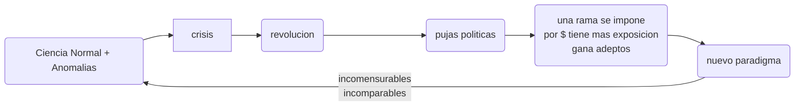

# Intro

Episteme moderna:

*   construye el paradigma moderno

*   criterio de demarcación: el método científico

     *    No Ciencia

           *   Conocimientos Aceptados (Diálogo)
                *   Filosofía (greco-latina)
                *   Teología (edad media - religión)
           *   Conocimientos Negados
                *   Astrología
                *   Culturas ancestrales

     *    Ciencia

           *   Desarrollo Tecnológico -> Progreso material "indefinidamente"  creciente

     *    Boaventura: cuestiona la sustenibilidad de esta concepción de desarrollo en el tiempo

     *    Arocena: generar políticas científico-tecnológicas para que la brecha entre los países desarrollados y el tercer mundo no se profundicen. "subámonos al primer mundo". no cuestiona la lógica de desarrollo.

          ​

# Modelos Argentina

AgroExportador

'30 Crisis '29 -> Modelo de sustitución de importacioneos

Peronismo

'fines70: Predominio financiero

# Paradigma Moderno

Kuhn: "la estructura de las revoluciones científicas (1962)"

## Paradigma:

+   leyes y teorías
+   prescripciones metodológicas (el instrumental válido/aceptable)
+   presupuestos metafísicos (filosóficos)

## Paradigma Clásico (determinista)

#### Ciencia Normal

Progresa dentro del paradigma aceptado.

Porque los paradigmas son incomparables, no se pued

_pag 40e_ lar de progreso. 

# conceptos del paradigma tecnologico

schumpeter

+   invención
    +   creacion de nueva tecnica en el ambito cientifico-tecnologico (laboratorio/investigación)
+   innovación
    +   introducción en el sist.productivo de una invención ($)
        +   radical: inauhura un paradigma tecnológico (las 3 Revoluciones industriales)
        +   incremental
+   difusión
    +   la expansión a lo largo del todo el sistema industrial de una innovación.
+   la innovacion tecnologiarenueva al capitalismo y al sistema productivo